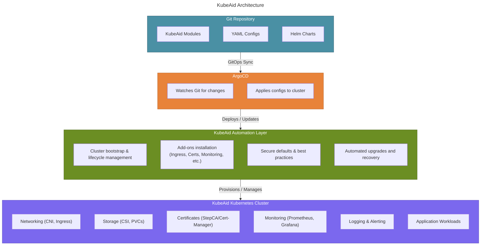

# Welcome to **KubeAid.io** - The home of Kubernetes Aid

**KubeAid** is a Kubernetes management suite, offering a way to setup and operate K8s clusters, following gitops and
automation principles.

Table of Contents
=================
* [KubeAid Overview](#KubeAid-Overview)
* [Kubeaid feature goals](#Kubeaid-feature-goals)
* [The Problem KubeAid Solves](#The-Problem-KubeAid-Solves)
* [KubeAid Architecture Overview](#KubeAid-Architecture-Overview)
* [Setup of Kubernetes clusters](#Setup-of-Kubernetes-clusters)
* [Installation](#Installation)
  * [documentation](./docs/README.md) 
* [Support](#Support)
* [Secrets](#Secrets)
* [License](#License)
* [Technical details on the features](#Technical-details-on-the-features)
* [Documentation](#Documentation)

-----------------
## KubeAid Overview
1. Purpose and Scope
       KubeAid is a comprehensive Kubernetes platform management system that provides production-ready cluster deployment and operations using GitOps principles. It delivers a complete stack including infrastructure provisioning, monitoring, security, networking, and data persistence, with everything managed as code through ArgoCD.
2. What is KubeAid
      KubeAid is a GitOps-centric platform that transforms Kubernetes cluster management into a declarative, version-controlled process. It provides:

- **Multi-cloud infrastructure provisioning** supporting azure, aws, hetzner, and bare metal using cluster api.
- **100+ pre-configured Helm charts** in argocd-helm-charts/ with automated weekly updates
- **Comprehensive monitoring** using kube-prometheus with Jsonnet-based generation
- **Unified access management** through Teleport for Kubernetes, applications, and databases
- **Automated operations** including chart updates, release management, and backup strategies.

- The entire platform is managed through a single Git repository where configuration changes trigger automated deployments via ArgoCD.

## KubeAid feature goals:

- Setup of k8s clusters on physical servers (on-premise or at e.g. [Hetzner.com](https://hetzner.com)) and in cloud
  providers like Azure AKS, Amazon AWS or Google GCE
- Auto-scaling for all cloud k8s clusters and easy manual scale-up for physical servers
- Manage an ever-growing list of Open Source k8s applications (see `argocd-helm-charts/` folder for a list)
- Build advanced, customized Prometheus monitoring, using just a per-cluster config file, with automated handling of
  trivial alerts, like disk filling.
- Gitops setup - ALL changes in cluster, is done via Git AND we detect if anyone adds anything in cluster or modifies
  existing resources, without doing it through Git.
- Regular application updates with security and bug fixes, ready to be issued to your cluster(s) at will
- Air-gapped operation of your clusters, to ensure operational stability
- Cluster security - ensuring least priviledge between applications in your clusters, via resource limits and
  per-namespace/pod firewalling.
- Backup, recovery and live-migration of applications or entire clusters
- Major cluster upgrades, via a shadow Kubernetes setup utilizing the recovery and live-migration features
- Supply chain attack protection and discovery - and security scans of all software used in cluster

## The Problem KubeAid Solves

Operations teams face two constant challenges:

1. Building highly available setups – This is complex, always evolving as the software used in the setup evolves.

2. Enabling application teams to move faster – By improving how apps run in production.

Even with Kubernetes, most teams need to make the same decisions and solve the same problems again and again.

KubeAid changes this by providing a constantly evolving solution for high availability and security. Enabling the collaboration of operations teams across the
world and increase the velocity of the team.

Combined with the services provided by [Obmondo](https://obmondo.com) - the makers of KubeAid, your teams no longer need subject matter experts for every piece of the stack, and can instead focus on what matters most: helping application teams succeed in production.

[Read more about this](./docs/kubeaid/why-kubeaid.md)

## KubeAid Architecture Overview

KubeAid follows a GitOps-driven, automated approach to provision and manage production-ready Kubernetes clusters. The diagram below explains the high-level flow:

## Setup of Kubernetes clusters

Mirror this repo and the [kubeaid-config](https://github.com/Obmondo/kubeaid-config) repo into a Git platform of your choice,
and follow the `README` file in the `kubeaid-config` repository on how to write the config for your Kubernetes cluster.

You must NEVER make any changes on the master/main branch of you mirror of the kubeaid repository, as we use this to
deliver updates to you. This means that your cluster can be updated simply by running `git pull` on your copy of
this repository.

All customizations happens in your `kubeaid-config` repo.

## Installation

For complete installation instructions, see the **[Getting Started Guide](./docs/getting-started/README.md)** which includes:

- Prerequisites and pre-configuration
- Installation (supports AWS, Azure, Hetzner, Bare Metal, and Local K3D)
- Post-configuration and basic operations

For hosting-specific reference and operations guides, see the [documentation](./docs/README.md).

## Support

Besides the community support, the primary developers of this project offers support via services on
[Obmondo](https://obmondo.com) - where you can opt to have us observe your world - and react to your alerts, and/or
help you with developing new features or other tasks on clusters, setup using this project.

There are ZERO vendor lockin - so any subscription you sign - can be cancelled at any time - you only pay for 1 month at
a time.

With a subscription we will be there, to ensure your smooth operations, in times of sickness and employee shortages -
and able to scale your development efforts on kubeaid if needed.

## Secrets

We use [sealed-secrets](https://github.com/bitnami-labs/sealed-secrets/) which means secrets are encrypted locally (by
the developer who knows them) and committed to your kubeaid config repo under the path
`k8s/<cluster-name>/sealed-secrets/<namespace>/<name-of-secret>.json`. See documentation in
[./argocd-helm-charts/sealed-secrets/README.md](./argocd-helm-charts/sealed-secrets/README.md)

## License

**KubeAid** is licensed under the Affero GPLv3 license, as we believe this is the best way to protect against the patent
attacks we see hurting the industry; where companies submit code that uses technology they have patented, and then turn
and litigate companies that use the software.

The Affero GNU Public License has always been focused on ensuring everyone gets the same privileges, protecting against methods
like [TiVoization](https://en.wikipedia.org/wiki/Tivoization), which means it's very much aligned with the goals of this
project, namely to allow everyone to work on a level playing ground.

## Technical details on the features

Read about the current status of all features of KubeAid from these links:

- [GitOps setup and change detection](./docs/kubeaid/features-technical-details.md#gitops-setup-and-change-detection)  
- [Auto-scaling for all cloud k8s clusters and easy manual scale-up for physical servers](./docs/kubeaid/features-technical-details.md#auto-scaling-for-all-cloud-k8s-clusters-and-easy-manual-scale-up-for-physical-servers)  
- [Manage an ever-growing list of Open Source k8s applications](./docs/kubeaid/features-technical-details.md#manage-an-ever-growing-list-of-open-source-k8s-applications-see-argocd-helm-charts-folder-for-a-list)  
- [Build advanced, customized Prometheus monitoring, using just a per-cluster config file](./docs/kubeaid/features-technical-details.md#build-advanced-customized-prometheus-monitoring-using-just-a-per-cluster-config-file)  
- [Regular application updates with security and bug fixes, ready to be issued to your cluster(s) at will](./docs/kubeaid/features-technical-details.md#regular-application-updates-with-security-and-bug-fixes-ready-to-be-issued-to-your-clusters-at-will)  
- [Air-gapped operation of your clusters, to ensure operational stability](./docs/kubeaid/features-technical-details.md#air-gapped-operation-of-your-clusters-to-ensure-operational-stability)  
- [Cluster security](./docs/kubeaid/features-technical-details.md#cluster-security)  
- [Backup, recovery and live-migration of applications or entire clusters](./docs/kubeaid/features-technical-details.md#backup-recovery-and-live-migration-of-applications-or-entire-clusters)  
- [Major cluster upgrades, via a shadow Kubernetes setup utilizing the recovery and live-migration features](./docs/kubeaid/features-technical-details.md#major-cluster-upgrades-via-a-shadow-kubernetes-setup-utilizing-the-recovery-and-live-migration-features)  
- [Supply chain attack protection and discovery - and security scans of all software used in cluster](./docs/kubeaid/features-technical-details.md#supply-chain-attack-protection-and-discovery---and-security-scans-of-all-software-used-in-cluster)  

## Documentation

You can find the documentation, guides and tutorials at the `/docs` directory.