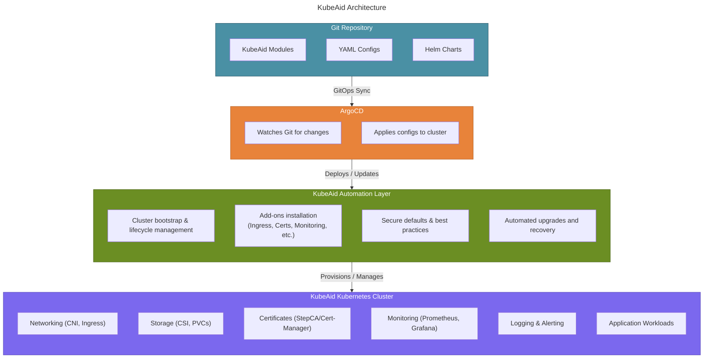

# Welcome to **KubeAid.io** - The home of Kubernetes Aid

**KubeAid** is a Kubernetes management suite, offering a way to set up and operate Kubernetes clusters, following GitOps and
automation principles.

Table of Contents
=================
* [KubeAid Overview](#KubeAid-Overview)
* [KubeAid feature goals](#Kubeaid-feature-goals)
* [The Problem KubeAid Solves](#The-Problem-KubeAid-Solves)
* [KubeAid Architecture Overview](#KubeAid-Architecture-Overview)
* [Setup of Kubernetes clusters](#Setup-of-Kubernetes-clusters)
* [Installation](#Installation)
  * [documentation](./docs/README.md)
* [Support](#Support)
* [Secrets](#Secrets)
* [License](#License)
* [Technical details on the features](#Technical-details-on-the-features)
* [Documentation](#Documentation)

-----------------
## KubeAid Overview

### 1. Purpose and Scope

KubeAid is a comprehensive Kubernetes platform management system that provides production-ready cluster deployment and operations using GitOps principles. It delivers a complete stack including infrastructure provisioning, monitoring, security, networking, and data persistence, with everything managed as code through ArgoCD.

### 2. What is KubeAid

KubeAid is a GitOps-centric platform that transforms Kubernetes cluster management into a declarative, version-controlled process. It provides:

- **Multi-cloud infrastructure provisioning** supporting Azure, AWS, Hetzner (HCloud and Bare Metal), and on-premise bare metal using [Cluster API](https://cluster-api.sigs.k8s.io/).
- **100+ pre-configured Helm charts** in [`argocd-helm-charts`](./argocd-helm-charts/) with automated weekly updates. We test and provide default values following best practices, handling the configuration complexity so you can focus on your business logic.
- **Comprehensive monitoring** using [kube-prometheus](https://github.com/prometheus-operator/kube-prometheus) with [Jsonnet](https://jsonnet.org/)-based generation.
- **Unified access management** through Teleport for Kubernetes, applications, and databases.
- **Automated operations** including Helm chart updates, [release management](https://github.com/Obmondo/KubeAid/releases), and backup strategies.

The entire platform is managed through a single Git repository where configuration changes can trigger deployments via ArgoCD. By default, auto-sync is not enabled, giving you full control over when changes are applied. You can enable auto-sync for your application workloads if you prefer automated deployments.

## KubeAid feature goals:

- Set up Kubernetes clusters on:
  - **Physical servers**: On-premise and [Hetzner](https://www.hetzner.com/) Bare Metal
  - **Cloud VMs**: [Hetzner HCloud](https://www.hetzner.com/cloud), [AWS](https://aws.amazon.com/), and [Azure](https://azure.microsoft.com/)
  - **Hybrid clusters**: Combining Hetzner Bare Metal with HCloud VMs
- Auto-scaling for all cloud Kubernetes clusters and easy scaling for physical servers
- Manage an ever-growing list of Open Source Kubernetes applications (see [`argocd-helm-charts`](./argocd-helm-charts/) folder for a list)
- Build advanced, customised Prometheus monitoring using just a per-cluster config file, with automated handling of
  trivial alerts, like disk filling.
- GitOps setup - ALL changes in a cluster are done via Git AND we detect if anyone adds anything in cluster or modifies
  existing resources without doing it through Git.
- Frequent updates for KubeAid-managed applications with security and bug fixes, ready to be issued to your cluster(s) at will - so you can focus on your business applications.
- [Air-gapped operation](https://kubernetes.io/blog/2023/10/12/bootstrap-an-air-gapped-cluster-with-kubeadm/) of your clusters, to ensure operational stability
- Cluster security - we provide proper NetworkPolicies to secure intra-cluster and ingress traffic, ensuring least privilege between applications
- Backup, recovery and live migration of applications or entire clusters
- Major cluster upgrades via a shadow Kubernetes setup (a parallel failover cluster that allows you to test upgrades and seamlessly switch over), utilising the recovery and live migration features
- Supply chain attack protection and discovery, with frequent security scans of all software used in the clusters (as new vulnerabilities are constantly being discovered)

## The Problem KubeAid Solves

Operations teams face two constant challenges:

1. Building highly available setups – This is complex, always evolving as the software used in the setup evolves.

2. Enabling application teams to move faster – By improving how apps run in production.

Even with Kubernetes, most teams need to make the same decisions and solve the same problems again and again.

KubeAid changes this by providing a constantly evolving solution for high availability and security. Enabling the collaboration of operations teams across the
world and increase the velocity of the team.

Combined with the services provided by [Obmondo](https://obmondo.com) - the makers of KubeAid, your teams no longer need subject matter experts for every piece of the stack, and can instead focus on what matters most: helping application teams succeed in production.

[Read more about this](./docs/kubeaid/why-kubeaid.md)

## KubeAid Architecture Overview

KubeAid follows a GitOps-driven, automated approach to provision and manage production-ready Kubernetes clusters. The diagram below explains the high-level flow:

## Setup of Kubernetes clusters

We use **KubeAid CLI** to set up and manage Kubernetes clusters. The CLI handles all the complexity of cluster provisioning, configuration, and lifecycle management.

We recommend mirroring the KubeAid repository into your own Git platform. This ensures you own the product you are using — if access to the upstream KubeAid repository is ever lost, you still have full control over your infrastructure.

You must NEVER make any changes on the master/main branch of your mirror of the KubeAid repository, as we use this to deliver updates to you. This means that your cluster can be updated simply by running `git pull` on your copy of this repository.

After installation, you will work with a `kubeaid-config` repository that contains all your cluster-specific customisations. The [Getting Started Guide](./docs/getting-started/README.md) explains this workflow in detail.

## Installation

For complete installation instructions, see the **[Getting Started Guide](./docs/getting-started/README.md)** which includes:

- Prerequisites and pre-configuration
- Installation (supports AWS, Azure, Hetzner HCloud, Hetzner Bare Metal, and Local K3D)
- Post-configuration and basic operations

For hosting-specific reference and operations guides, see the [documentation](./docs/README.md).

## Support

Besides community support, [Obmondo](https://obmondo.com) (the primary developers of this project) offers professional support services. We can observe your clusters, react to your alerts, and help you develop new features or other tasks on clusters set up using this project.

There is ZERO vendor lock-in. Any subscription you sign can be cancelled at any time — you only pay for one month at a time.

With a subscription, we will ensure smooth operations for you. We will speed up your development efforts on KubeAid if needed.

## Secrets

We use [sealed-secrets](https://github.com/bitnami-labs/sealed-secrets/) which means secrets are encrypted locally (by the developer who knows them) and committed to your KubeAid config repository.

You can read the details [here](./argocd-helm-charts/sealed-secrets/README.md).

## License

**KubeAid** is licensed under the Affero GPLv3 license, as we believe this is the best way to protect against the patent
attacks we see hurting the industry; where companies submit code that uses technology they have patented, and then turn
and litigate companies that use the software.

The Affero GNU Public License has always been focused on ensuring everyone gets the same privileges, protecting against methods
like [TiVoization](https://en.wikipedia.org/wiki/Tivoization), which means it's very much aligned with the goals of this
project, namely to allow everyone to work on a level playing ground.

## Technical details on the features

Read about the current status of all features of KubeAid from these links:

- [GitOps setup and change detection](./docs/kubeaid/features-technical-details.md#gitops-setup-and-change-detection)
- [Auto-scaling for all cloud Kubernetes clusters and easy scaling for physical servers](./docs/kubeaid/features-technical-details.md#auto-scaling-for-all-cloud-kubernetes-clusters-and-easy-scaling-for-physical-servers)
- [Manage an ever-growing list of Open Source Kubernetes applications](./docs/kubeaid/features-technical-details.md#manage-an-ever-growing-list-of-open-source-kubernetes-applications-see-argocd-helm-charts-folder-for-a-list)
- [Build advanced, customised Prometheus monitoring using just a per-cluster config file](./docs/kubeaid/features-technical-details.md#build-advanced-customised-prometheus-monitoring-using-just-a-per-cluster-config-file)
- [Regular application updates with security and bug fixes, ready to be issued to your cluster(s) at will](./docs/kubeaid/features-technical-details.md#regular-application-updates-with-security-and-bug-fixes-ready-to-be-issued-to-your-clusters-at-will)
- [Air-gapped operation of your clusters, to ensure operational stability](./docs/kubeaid/features-technical-details.md#air-gapped-operation-of-your-clusters-to-ensure-operational-stability)
- [Cluster security](./docs/kubeaid/features-technical-details.md#cluster-security)
- [Backup, recovery and live-migration of applications or entire clusters](./docs/kubeaid/features-technical-details.md#backup-recovery-and-live-migration-of-applications-or-entire-clusters)
- [Major cluster upgrades, via a shadow Kubernetes setup utilising the recovery and live-migration features](./docs/kubeaid/features-technical-details.md#major-cluster-upgrades-via-a-shadow-kubernetes-setup-utilising-the-recovery-and-live-migration-features)
- [Supply chain attack protection and discovery - and security scans of all software used in cluster](./docs/kubeaid/features-technical-details.md#supply-chain-attack-protection-and-discovery---and-security-scans-of-all-software-used-in-cluster)

## Documentation

You can find the documentation, guides and tutorials in the [`/docs`](./docs/) directory.
