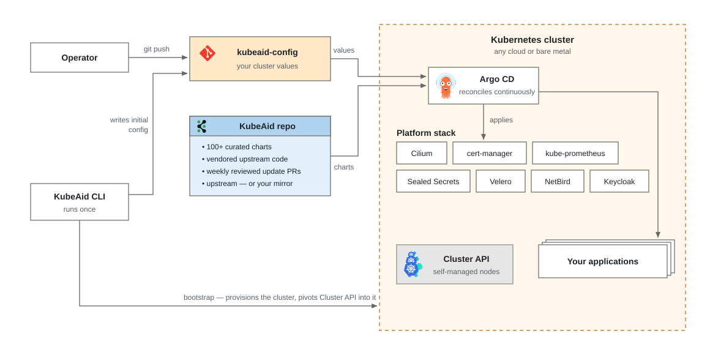

# KubeAid

[](https://deepwiki.com/Obmondo/KubeAid)
[](LICENSE)

**KubeAid is an open-source Kubernetes platform: one tested, maintained way to install and operate Kubernetes
clusters on every platform** — AWS (self-managed or EKS), Azure (self-managed or AKS), Hetzner (HCloud and Bare
Metal), on-premise bare metal, or locally on K3D.

Running Kubernetes means constantly tracking a moving ecosystem: which chart just got deprecated, which API version is
about to break, which default is a security risk, what current best practice looks like. **KubeAid's job is to carry
that mental overhead for you.** We curate the stack, test the defaults, track deprecations and breaking changes, and
ship the result as regular updates — you review and pull them when it suits you. It also gives you a trustworthy
source of Helm charts: every chart is vendored into this repository and updated through periodic, reviewed releases —
not pulled live from upstream registries at deploy time — which protects you against supply-chain attacks.

This repository holds the platform itself — curated Helm charts, monitoring, and secure defaults. It is consumed by
the **[KubeAid CLI](https://github.com/Obmondo/kubeaid-cli)**, which is the tool you actually run to create and manage
clusters.

→ [**Why KubeAid?**](https://kubeaid.io/docs/kubeaid/why-kubeaid)
· [**Getting Started**](https://kubeaid.io/docs/getting-started/)
· [**Full Documentation**](https://kubeaid.io/docs/)

## Table of Contents

- [What Exactly Is KubeAid?](#what-exactly-is-kubeaid)
- [How It Works](#how-it-works)
- [Quick Start](#quick-start)
- [Features](#features)
- [Documentation](#documentation)
- [Contributing](#contributing)
- [Community and Governance](#community-and-governance)
- [Roadmap](ROADMAP.md)
- [Support](#support)
- [License](#license)

## What Exactly Is KubeAid?

Installing Kubernetes looks easy until you do it on a second platform. AWS wants IAM roles, Azure wants Workload
Identity, Hetzner and bare metal have their own models — and that's before monitoring, ingress, storage, and upgrades.
KubeAid removes the per-platform relearning: one workflow, one repository layout, one set of defaults, everywhere.

It is three pieces that work together:

1. **This repository (KubeAid)** — the platform definition: 100+ maintained Helm chart wrappers in
   [`argocd-helm-charts/`](./argocd-helm-charts/), with tested default values and automated weekly updates, plus
   [kube-prometheus](https://github.com/prometheus-operator/kube-prometheus) monitoring generated with
   [Jsonnet](https://jsonnet.org/). You don't run anything from here directly — it is consumed by the KubeAid CLI, and
   later by ArgoCD from your own mirror of it. Mirroring it into your own Git platform means you keep full control
   even if access to the upstream repository is ever lost.
2. **[KubeAid CLI](https://github.com/Obmondo/kubeaid-cli)** — the entry point. A command-line tool you run once per
   cluster: it consumes this repository, generates your configuration, and bootstraps the cluster using
   [Cluster API](https://cluster-api.sigs.k8s.io/) (or [KubeOne](https://github.com/kubermatic/kubeone) for SSH-only
   bare metal).
3. **Your `kubeaid-config` repository** — generated for you during bootstrap; holds all your cluster-specific
   settings, layered on top of your KubeAid mirror. ArgoCD inside the cluster watches it and applies changes, so Git
   is the single source of truth for everything running in the cluster.

Every KubeAid cluster ships with [Cilium](https://cilium.io/) (kube-proxyless),
[ArgoCD](https://argo-cd.readthedocs.io/), [Sealed Secrets](https://github.com/bitnami-labs/sealed-secrets/), and
kube-prometheus. By default, auto-sync is not enabled, so you decide when changes are applied; you can turn it on per
application if you prefer automated deployments.

## How It Works

The KubeAid CLI runs once to bootstrap: it generates your `kubeaid-config` repository and provisions the cluster. From
then on, ArgoCD inside the cluster continuously syncs from `kubeaid-config`, reconciling both the platform stack and
your applications:

<!-- markdownlint-disable MD033 -->
<picture>
  <source media="(prefers-color-scheme: dark)" srcset="./docs/images/kubeaid-architecture-dark.svg">
  
</picture>
<!-- markdownlint-enable MD033 -->

One rule to know up front: never commit directly to the master/main branch of your KubeAid mirror — that branch is how
updates are delivered to you, so keeping it clean means updating your cluster is as simple as a `git pull`.

## Quick Start

Install the [KubeAid CLI](https://github.com/Obmondo/kubeaid-cli/releases), then:

```sh
# Interactive prompt walks you through cluster name, platform
# (local K3D, AWS, Azure, Hetzner, bare metal) and everything else
kubeaid-cli config generate --configs-directory ./outputs/configs/<cluster>/

# Review the generated config, then bring the cluster up
kubeaid-cli cluster bootstrap --configs-directory ./outputs/configs/<cluster>/
```

Choosing local K3D gives you a playground on your own machine — the workflow is identical to a production cloud cluster. The
**[Getting Started Guide](./docs/getting-started/README.md)** walks through prerequisites, configuration, installation,
and day-2 operations for every supported platform.

## Features

* **No-mental-overhead updates**: we track what's broken, deprecated, or superseded across the whole stack, and ship
  tested chart and security updates weekly — ready to be applied to your clusters at will, so you can focus on your
  own applications.
* **Multi-cloud installation**: self-managed clusters on AWS, Azure, Hetzner, and bare metal; managed control planes
  on [EKS](https://aws.amazon.com/eks/) and
  [AKS](https://azure.microsoft.com/en-us/products/kubernetes-service); hybrid Hetzner Bare Metal + HCloud clusters.
  One install method, any target.
* **GitOps everything**: all cluster changes go through Git, and drift is detected if anyone changes resources
  directly in the cluster.
* **Curated application catalogue**: an ever-growing list of open-source Kubernetes applications in
  [`argocd-helm-charts/`](./argocd-helm-charts/), each wrapped with default values that follow current best practices.
  Upstream charts are vendored into this repository, so what you deploy is exactly what was reviewed — a defence
  against supply-chain attacks, backed by frequent security scans of all software used in the clusters.
* **Monitoring built in**: advanced, customised Prometheus monitoring from a per-cluster config file, with automated
  handling of trivial alerts like disks filling up.
* **Secrets in Git, safely**: [sealed-secrets](./argocd-helm-charts/sealed-secrets/README.md) encrypts secrets locally
  before they are committed to your config repository.
* **Unified access management** through Teleport for Kubernetes, applications, and databases.
* **Cluster security**: NetworkPolicies enforce least privilege between applications and secure intra-cluster and
  ingress traffic.
* **Lifecycle operations**: auto-scaling, backup and recovery, live migration of applications or whole clusters, major
  upgrades via a parallel shadow cluster, and [air-gapped
  operation](https://kubernetes.io/blog/2023/10/12/bootstrap-an-air-gapped-cluster-with-kubeadm/).
* **Compliance by default**: security and operational defaults mapped to ISO 27001:2022, covering GDPR and NIS2 goals.

The implementation status of each feature is documented in
[Technical Details on the Features](./docs/kubeaid/features-technical-details.md); planned work lives in the
[Roadmap](ROADMAP.md).

## Documentation

You can find the documentation, guides and tutorials in the [`/docs`](./docs/) directory.

## Contributing

Contributions are welcome — bug reports, chart updates, new providers, and documentation alike. See
[CONTRIBUTING.md](./CONTRIBUTING.md) for the workflow; note that commits need a DCO sign-off (`git commit -s`).

## Community and Governance

- [Code of Conduct](CODE_OF_CONDUCT.md) — we follow the CNCF Community Code of Conduct.
- [Governance](GOVERNANCE.md) — how decisions are made and how maintainers are added.
- [Maintainers](MAINTAINERS.md) — current maintainers of the project.
- [Adopters](ADOPTERS.md) — organizations running KubeAid; add yours with a PR.
- [Security policy](SECURITY.md) — how to report vulnerabilities privately.

## Support

Community support happens through the issue tracker. Besides that, [Obmondo](https://obmondo.com) (the primary
developers of this project) offers professional support: we can observe your clusters, react to your alerts, and help
you develop new features on clusters set up using this project.

There is zero vendor lock-in — KubeAid works the same with or without a support agreement, and any agreement can be
cancelled at any time.

## License

**KubeAid** is licensed under the [Affero GPLv3 license](LICENSE), as we believe this is the best way to protect
against the patent attacks we see hurting the industry; where companies submit code that uses technology they have
patented, and then turn and litigate companies that use the software.

The Affero GNU Public License has always been focused on ensuring everyone gets the same privileges, protecting against
methods like [TiVoization](https://en.wikipedia.org/wiki/Tivoization), which means it's very much aligned with the goals
of this project, namely to allow everyone to work on a level playing ground.
