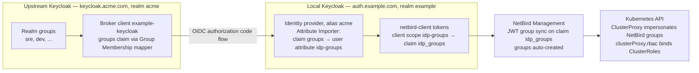

# Keycloak-to-Keycloak Identity Brokering (with group sync to NetBird)

This guide lets users from one Keycloak (the **upstream** organisation Keycloak,
e.g. an MSP's staff realm) log into a KubeAid-managed Keycloak (the **local**
customer realm that NetBird authenticates against), with their upstream **group
memberships travelling along**. The groups end up as NetBird groups (via JWT
group sync) and finally as Kubernetes groups via the NetBird ClusterProxy, so
`kubectl auth whoami` shows them.

No groups are created in the local realm: group membership is owned by the
upstream Keycloak alone, and every login re-syncs it.

Written against Keycloak 26 on both sides; anything 24+ behaves the same
(older versions don't have the user-profile step below).

Example names used throughout — replace with your own:

| | Upstream (identity source) | Local (customer / NetBird) |
|---|---|---|
| Keycloak URL | `https://keycloak.acme.com/auth` | `https://auth.example.com/auth` |
| Realm | `acme` | `example` |
| NetBird Management | — | `https://vpn.example.com` |
| Kubernetes cluster | — | `prod-example-com` |

## How the pieces fit together



### Why the claim is named `idp_groups`, not `groups`

kubeaid-cli's Keycloak reconciler **owns** a `groups` client scope on
`netbird-client` (a Group Membership mapper that emits the user's *local* realm
groups as a `groups` claim). If you add a second mapper writing the same claim,
the two clobber each other — a brokered user with no local groups gets
`"groups": []` half the time — and re-running the KubeAid bootstrap restores
the CLI-owned mapper anyway. So the brokered groups travel in their own claim,
`idp_groups`, and NetBird is pointed at that claim instead.

## Prerequisites

* Admin access to both Keycloaks; both reachable over HTTPS.
* The local realm was bootstrapped by kubeaid-cli, i.e. the `netbird-client`
  client already exists.
* The groups you want to forward exist **as real groups with members** in the
  upstream realm (Manage → Groups). A claim is only ever as good as the
  memberships behind it.

## Step 1 — upstream Keycloak: create the broker client

In the `acme` realm:

1. **Clients → Create client**
   * Client type: `OpenID Connect`
   * Client ID: `example-keycloak` (name it after the customer)
2. Capability config:
   * Client authentication: `On` (confidential client)
   * Standard flow: `On` — everything else `Off`
3. Access settings — Valid redirect URIs:

   ```text
   https://auth.example.com/auth/realms/example/broker/acme/endpoint
   ```

   The last path segment before `/endpoint` is the identity-provider **alias**
   you will choose in step 2 — they must match.
4. Save, then copy the client secret from the **Credentials** tab.
5. Make the client emit the groups claim: **Client scopes** tab (on the client)
   → **Add client scope** → `groups` → add as **Default**.
   * On a KubeAid-managed upstream realm this scope already exists —
     kubeaid-cli creates it for NetBird. On any other Keycloak, first create a
     client scope `groups` with a **Group Membership** mapper (Token Claim
     Name `groups`, Full group path `Off`, add to ID/access token `On`).
6. Verify: **Clients → example-keycloak → Client scopes → Evaluate**, pick a
   test user → Generated access token must contain `"groups": [...]`.

## Step 2 — local Keycloak: create the identity provider

In the `example` realm:

1. **Identity providers → Keycloak OpenID Connect**
2. * Alias: `acme` — must match the redirect URI registered in step 1.
     The alias is baked into that URI, so pick it once and don't rename.
   * Display name: `Acme SSO` (this is the button users see on login pages)
   * Use discovery endpoint: `On`, with:

     ```text
     https://keycloak.acme.com/auth/realms/acme/.well-known/openid-configuration
     ```

   * Client authentication: `Client secret sent as post`
   * Client ID / Client secret: from step 1
3. After saving, in **Advanced settings**:
   * Scopes: `openid` (the upstream `groups` scope is a *default* scope on the
     broker client, so it's included without being requested here)
   * Trust Email: `On` (otherwise every brokered user lands in "verify email")
   * Sync mode: `Force` — re-imports the mappers on every login, which is what
     keeps group changes flowing. `Legacy`/`Import` only syncs on first login.

> **Issuer must match byte-for-byte.** Keycloak validates the token `iss`
> against the Issuer field as an exact string. The real issuer has **no
> trailing slash** (check with
> `curl -s https://keycloak.acme.com/auth/realms/acme/.well-known/openid-configuration | jq -r .issuer`).
> A trailing slash produces the generic "Unexpected error when authenticating
> with identity provider" *after* the user has entered correct credentials.
> If you used the discovery endpoint, leave the field exactly as discovered.

## Step 3 — local Keycloak: declare the `idp-groups` user attribute

Keycloak 24+ silently **drops** writes to user attributes that aren't declared
in the realm's user profile ("unmanaged attributes"). Without this step, the
mapper in step 4 appears to work but the attribute never lands on the user.

**Realm settings → User profile → Attributes → Create attribute**:

* Name: `idp-groups`
* Multivalued: `On`
* Who can edit / who can view: admin only (untick User) — users have no
  business editing their own group list
* Required: `Off`

Alternative (coarser): **Realm settings → General → Unmanaged attributes** =
`Enabled`. The explicit attribute declaration is preferred.

## Step 4 — local Keycloak: import the claim (Attribute Importer)

**Identity providers → acme → Mappers → Add mapper**:

* Name: `idp-groups`
* Sync mode override: `Force`
* Mapper type: `Attribute Importer`
* Claim: `groups`
* User Attribute Name: `idp-groups`

> **Every mapper on the identity provider runs on every brokered login.**
> A single broken mapper (see troubleshooting) fails the whole login for
> everyone. Delete experiments — don't leave them lying around disabled-in-
> spirit, because there is no disable toggle.

Note the deliberate absence of *Advanced Claim to Group* / *Claim to Group*
mappers here: those map brokered users into **local** realm groups, which is
exactly what this setup avoids.

## Step 5 — local Keycloak: emit the attribute as a token claim

Create the scope:

1. **Client scopes → Create client scope**
   * Name: `idp-groups`
   * Type: `None` (it's assigned per-client below)
   * Protocol: `OpenID Connect`
   * Include in token scope: `On`
2. On the new scope: **Mappers → Configure a new mapper → User Attribute**
   * Name: `idp-groups`
   * User Attribute: `idp-groups`
   * Token Claim Name: `idp_groups`
   * Claim JSON Type: `String`
   * Multivalued: `On`
   * Aggregate attribute values: `On`
   * Add to ID token / access token / userinfo: `On` (NetBird reads the
     access token, so that one is the critical one)

Attach it: **Clients → netbird-client → Client scopes → Add client scope →
`idp-groups` → Default**.

## Step 6 — NetBird: enable JWT group sync

In the NetBird dashboard (`https://vpn.example.com`) as an admin,
**Settings → Groups**:

* Enable **JWT group sync**
* JWT claim: `idp_groups`
* **Leave "JWT allow groups" empty.** It is a *login gate*, not a filter:
  once set, any user whose token lacks one of the listed groups — including
  every local (non-brokered) user, whose tokens have no `idp_groups` claim at
  all — is refused login.
* Enable user-group propagation to peers, so policies and the ClusterProxy
  see the groups on the user's machines.

NetBird auto-creates a group per claim value the first time a user carrying it
logs in (or refreshes a token). Names are taken verbatim from the claim.

> **Never declare JWT-synced group names in the netbird-operator chart's
> `groups` values** on any cluster attached to this Management. The operator's
> Group reconciler is create-only: if the name already exists it wedges
> permanently on HTTP 409. JWT-synced groups are owned by NetBird's sync —
> nothing else may create them.

## Step 7 — Kubernetes access through the ClusterProxy

In the cluster's `values-netbird-operator.yaml` (kubeaid-config), reference the
synced groups **byte-for-byte** in the ClusterProxy RBAC:

```yaml
clusterProxy:
  enabled: true
  clusterName: prod-example-com
  rbac:
    - group: sre            # a JWT-synced group name, exactly as in the claim
      clusterRole: cluster-admin
    - group: dev
      clusterRole: view
```

Also make sure a NetBird policy (dashboard-managed) allows the users' group to
reach the `k8s-prod-example-com` group the proxy peer belongs to — RBAC decides
what they may do, the policy decides whether they can connect at all.

The user then runs:

```sh
netbird up                                            # brokered SSO login
netbird kubernetes write-kubeconfig prod-example-com
kubectl auth whoami
```

The `whoami` output lists the NetBird groups — i.e. the upstream Keycloak
groups — as Kubernetes groups.

## Testing checklist

Work through these in order; each one isolates the next layer:

1. **Brokered login works**: in a private browser window open
   `https://auth.example.com/auth/realms/example/account/` and pick
   `Acme SSO`. Upstream credentials must land you in the account console.
   (The same button appears on the device-flow verification page `netbird up`
   opens.)
2. **Attribute imported**: local admin console → Users → the federated user →
   **Attributes** tab shows `idp-groups` with the upstream groups.
3. **Claim emitted**: Clients → netbird-client → Client scopes → **Evaluate**
   → select the user → Generated access token contains
   `"idp_groups": ["sre", ...]`.
4. **NetBird groups**: after the user logs into NetBird once, the groups
   appear under Groups in the dashboard.
5. **Kubernetes**: `kubectl auth whoami` through the proxy kubeconfig shows
   them.

## Troubleshooting

**"Unexpected error when authenticating with identity provider"** (shown by
the local Keycloak *after* entering correct upstream credentials). The login
events (local realm → Events, look for `IDENTITY_PROVIDER_LOGIN_ERROR` /
`identity_provider_login_failure`) rarely say more; the usual causes, in order
of likelihood:

1. *Issuer mismatch* — almost always a trailing slash in the identity
   provider's Issuer field. Compare against `.well-known/openid-configuration`
   (see step 2) and make it identical.
2. *A broken identity-provider mapper.* All mappers run on every login. The
   classic: a regex mapper written with shell-style alternation
   `{One,Two,Three}` — in Java regex `{}` is a repetition quantifier, so it
   throws `PatternSyntaxException: Illegal repetition` and kills the login.
   Alternation is `(One|Two|Three)`. Delete stale mappers.
3. *Secret or redirect-URI mismatch* — check the upstream realm's Events too;
   code-for-token exchange failures show up there.

**Login works but the `idp-groups` attribute is empty** — the user-profile
declaration (step 3) is missing, so Keycloak drops the write. Second
possibility: the upstream token has no `groups` claim — re-check step 1.6.

**Attribute set but `idp_groups` missing from the token** — the `idp-groups`
scope isn't attached as *Default* on `netbird-client`, or the mapper isn't
`Multivalued`. Use Evaluate (testing checklist 3).

**Group changes upstream don't propagate** — Sync mode isn't `Force` (both the
provider setting and the mapper's override), or the user simply hasn't
re-logged in: sync happens at login/token refresh, never in the background.

**Local users locked out of NetBird after enabling JWT sync** — "JWT allow
groups" was set. Clear it (step 6).

**`netbird up` fails with `peer is already registered by a different User or a
Setup Key`** — good news first: the SSO chain works, this error comes from
NetBird Management, not Keycloak. The machine's WireGuard peer is still owned
by whoever registered it first (an earlier test login, or a setup key). Remove
that peer in the dashboard (Peers → delete) and run `netbird up` again as the
brokered user.

## References

* [Keycloak server administration — identity brokering](https://www.keycloak.org/docs/latest/server_admin/#_identity_broker)
* [NetBird self-hosted identity providers — Keycloak](https://docs.netbird.io/selfhosted/identity-providers)
