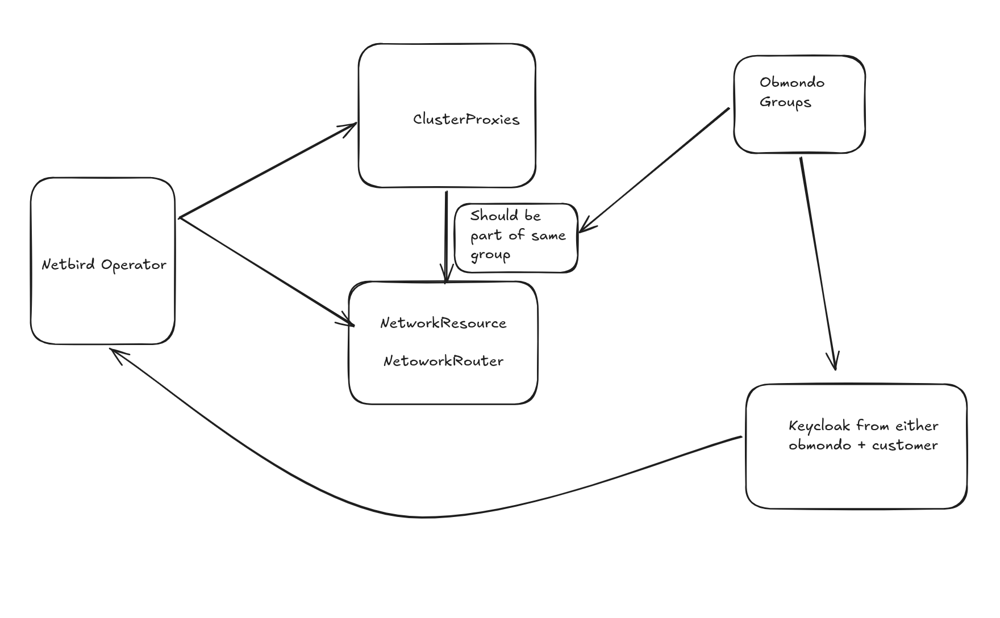
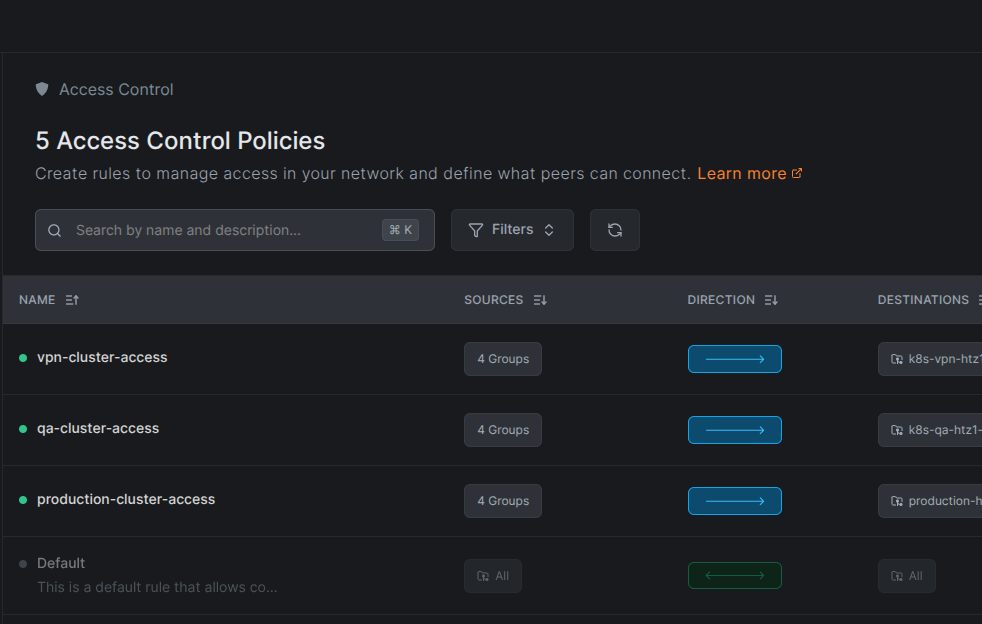
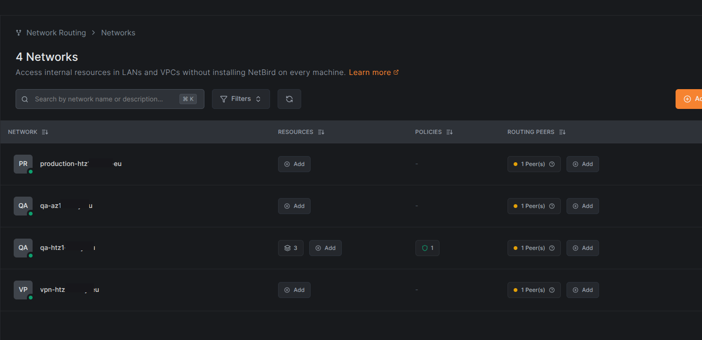
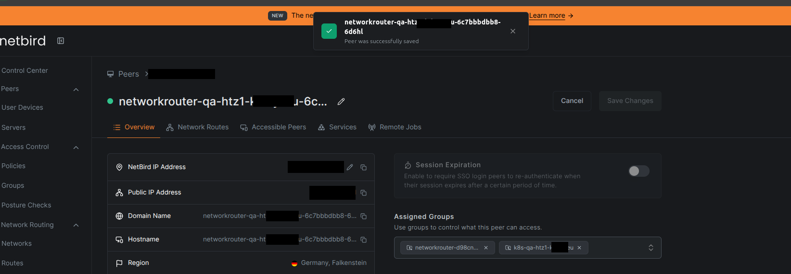
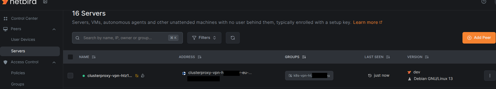

# Netbird VPN Debugging

This covers troubleshooting once a peer is set up but not behaving.

## Architecture



> **Note:** Obmondo Groups come from Keycloak and can be optional depending on the setup.

## Steps

1. Check connection status:

   ```sh
   netbird status -d
   netbird kubernetes list
   ```

   `netbird kubernetes list`: if it lists your clusters, the control-plane connection and Kubernetes proxy are up. If it errors, the problem is the mesh connection itself, not RBAC - skip to step 2.

2. If step 1 looks healthy but `kubectl` through the NetBird proxy still fails, reconnect:

   ```sh
   netbird down
   netbird up --management-url https://netbird.vpn.obmondo.com
   ```

3. If step 2 doesn't fix it, deregister and re-authenticate from scratch:

   ```sh
   netbird deregister   # alias: netbird logout
   netbird login --management-url https://netbird.vpn.obmondo.com
   netbird up
   ```

4. If `kubectl` still fails, check your permissions - you might just not have access, not a NetBird problem:

   ```sh
   $ kubectl --context <cluster-name> auth whoami
   ATTRIBUTE   VALUE
   Username    56484182-e700-4344-97b7-007d1f46a22c
   Groups      [/ArgoCDDevs /ArgoCDAdmins Obmondo /OperationLevelTwo All system:authenticated]
   ```

   > **Note:** these groups are from one account, not a confirmed list - check with a colleague who has access.

   If a group is missing, ask the admin to add it on Keycloak.

5. If you're not able to list using `kubectl --context <cluster-name> auth whoami`, ask the NetBird admin to check your roles/permissions for the cluster in the NetBird UI:

   ```sh
   asif@khan:~$ netbird kubernetes write-kubeconfig <cluster-name>
   Error: lookup 77.179.125.100.in-addr.arpa. on 10.255.255.2:53: no such host
   ```

6. Once your groups are validated as correct, it's worth restarting your PC to rule out a client-side issue - we've had cases where a restart resolved it after everything else checked out fine.

## Admin-side debugging

If the steps above don't resolve it, debug from the NetBird admin side.

1. Check the policies in the NetBird admin UI (**Access Control** → **Policies**) - there's a policy per cluster, e.g. `vpn-cluster-access`, `qa-cluster-access`, `production-cluster-access`. Confirm the policy for the affected cluster is not disabled.

   

2. Open that policy and check its **Sources** (groups) - confirm the group(s) the user is part of are actually present in the mapping. A user whose group isn't listed as a source for that cluster's policy will be denied even though the policy itself is enabled.

3. Check the policy's **Direction** is one-way, not bidirectional.

4. To see what a **Destination** actually points to: peer groups are under **Team → Groups**, network resources are under **Networks**.

> **Note:** we've isolated a bad policy before by disabling policies one at a time (keeping the others enabled) and running `netbird kubernetes list` after each toggle - this pinpointed which policy was causing the issue.

5. Each cluster has a network configured under **Networks**:

   

6. Check the **Routing Peers** column - it should have a network router. Click into the network router and check its assigned group. That group should have the same destination as specified in the policy's destination.

   

## Cluster-side debugging

1. Make sure the `netbird-operator` pod is running on the newer releases.

2. Check if the `clusterproxy` and `networkrouter` pods are running on the cluster. With our setup, a cluster has 3 clusterproxies.

3. Check that those are visible on the NetBird admin console under **Peers → Servers** - check for the `networkrouter` too, not just the clusterproxies.

   

4. Check they're attached to the correct group - in our case, the destination group set in the policies.

5. Check logs for the `networkrouter` and cluster proxies.
