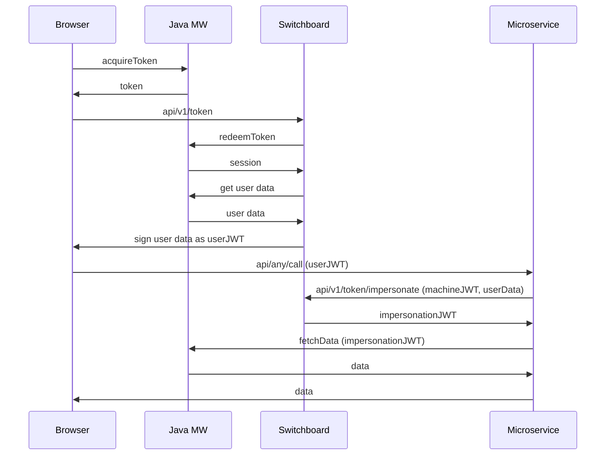

# Switchboard

Switchboard is a service complementing an App Suite stack providing a central point to integrate additional services like e.g. presence.
The service provides and manages the websocket connections directly with App Suite UI clients. The client which will be authenticated at an existing App Suite MW via the acquire/redeemToken API

## Introduction

The chart includes the following components:

* Deployment and Service of `switchboard`
* Ingress to access the API

Requirements:

* [Redis](#redis)
* [App Suite](#app-suite)

All configuration values can be listed with the command `helm show values path/to/chart/switchboard`.

Before the switchboard service can be deployed all dependencies should be up and running either as Kubernetes services or external services.

### Authentication flow

The switchboard service is able to issue JWT tokens for the App Suite UI clients.
Those can be used by service to get more information about the user.
It's also possible to have service accounts enabling microservices to impersonate any App Suite user
and if configured correctly, communicate with the Java Middleware service on behalf of the user.

The flow of the authentication is as follows:



Using the impersonation workflow allows switchboard to act as an IDP according to
[Java MW OAuth2](https://documentation.open-xchange.com/8/middleware/login_and_sessions/oauth_2.0_provider.html) documentation.

## Requirements

This section will provide any missing details for specific requirements.

### App Suite

In order to authenticate the deployments with App Suite, the
[redeemToken API](https://documentation.open-xchange.com/components/middleware/config/7.10.4/#mode=features&feature=Tokenlogin) needs to be configured.
In addition an application must be registered in `com.openexchange.tokenlogin.applications` (`secretProperties`).
This application id must also be configured in Switchboard as `apiSecret`

Example values if using `app-id` as application name:

```yaml
core-mw:
  secretProperties:
    com.openexchange.tokenlogin.applications: "app-id"
    com.openexchange.tokenlogin.app-id.announceId: "false"
switchboard:
  apiSecret: "app-id"
```

To enable the UI part of switchboard, these settings must be present for the user:

```yaml
    /opt/open-xchange/etc/settings/switchboard.properties:
      io.ox/switchboard//host: your.switchboard.service.deployment

    /opt/open-xchange/etc/switchboard.properties:
      com.openexchange.capability.switchboard: "true"
```

The switchboard service injects brand information into the JWT only if the `io.ox/core//brand` setting is configured for the user as a "protected" setting.
This ensures, the user can not provide false brand information, but can only be configured by the administrator.

#### Single domain setup

If hostnames are rare, it's possible to “mount” the switchboard REST API on the same hostname as the App Suite service by using a subpath.
This is a little trickier to setup, though.

The `host` setting should point to the App Suite service and the path can be handed to the client using the `apiRoot` setting.

Here's an example:

```yaml
    /opt/open-xchange/etc/settings/switchboard.properties:
      io.ox/switchboard//host: your.appsuite.host
      io.ox/switchboard//apiRoot: /switchboard/
```

This does *not* change the path of the websocket.
In your ingress configuration you need to map those paths to the switchboard service.

```yaml
    - match:
        - uri:
            prefix: /switchboard/api/
      name: switchboard-api-route
      rewrite:
        uri: /api/
      route:
        - destination:
            host: "switchboard.{{ .Release.Namespace }}.svc.cluster.local"
            port:
              number: 80
```

Exposing the websocket is also possible with a similar configuration:

```yaml
    - match:
        - uri:
            prefix: /socket.io
      name: switchboard-socket-route
      route:
        - destination:
            host: "switchboard.{{ .Release.Namespace }}.svc.cluster.local"
            port:
              number: 80
```

This used to be part of the static routes as this path was reserved by the Java Middleware.
As this component was removed with the App Suite 8.28 release, it's now safe to use it for the websocket maintained by the switchboard service.

### Webhook and push notifications

This feature enables mail and calendar updates to be sent to the App Suite UI via websocket.
The middleware will register a webhook on the switchboard which in turn will then send the notification to the UI. For further information please refer to the [documentation](https://documentation.open-xchange.com/8.21/middleware/push_notifications/webhooks.html).

To use webhooks and receive notifications, these settings must configured on the middleware:

```yaml
    com.openexchange.pns.transport.webhooks.enabled: "true"
    com.openexchange.webhooks.enabledIds: switchboard

  webhooks.yml:
    switchboard:
      uri: https://your-switchboard-hostname/api/v1/webhook
      webhookSecret: secret1
      signatureSecret: secret2
      signatureHeaderName: X-OX-Signature
```

The secrets `webhookSecret: secret1` and ` signatureSecret: secret2` must be the same as the ones configured in the switchboard deployment e.g.:

```yaml
    switchboard:
      appsuite:
        webhookSecret: secret1
        signatureSecret: secret2
```

### Webpush Notifications

Wepush Notifications allow the switchboard to send mail notifications to the App Suite UI via webpush to all connected clients of a user.

To enable webpush notifications you first need to configure webhooks as described above. Additionally a mail push service needs to be configured
for the middleware e.g. with the dovecot notify plugin. The middleware will then send a notification to the webhook of your switchboard instance which in turn will send the notification to the UI. For further information please refer to the [documentation](https://documentation.open-xchange.com/8/middleware/mail/mail_push.html).
The logo located at `/themes/default/logo_maskable_512.png` is currently used for web push notifications.

Configuring webpush on the switchboard requires a database to store the client's push endpoints and keys. Enable the database connection by configuring the following settings in your Helm chart:

```yaml
    switchboard:
      mysql:
        enabled: true
        existingSecret: ""
        host: ""
        database: ""
        connections: 10
        auth:
          user: ""
          password: ""
```

The configured database must be accessible from the switchboard deployment, and the database user must have the following permissions:

```sql
CREATE DATABASE IF NOT EXISTS `switchboard`;
CREATE USER IF NOT EXISTS `switchboard`@`%`
    IDENTIFIED BY 'examplePassword';
GRANT SELECT, INSERT, UPDATE, DELETE, CREATE, ALTER, CREATE ROUTINE, ALTER ROUTINE, DROP, EXECUTE, INDEX ON `switchboard`.* TO 'switchboard'@'%';
FLUSH PRIVILEGES;
```

Furthermore you also need to genereate and configure a [VAPID key pair](https://datatracker.ietf.org/doc/html/rfc8292) and a VAPID subject (typically a :mailto address or contact page) for the switchboard to send the notifications.

You can generate VAPID keys with the help of a running switchboard pod:

```shell
kubectl -n YOUR_NAMESPACE exec deployments/switchboard -- /usr/bin/node -e "console.log(require('web-push').generateVAPIDKeys())"
```

Output:
```javascript
{
  publicKey: 'examplePublicKey',
  privateKey: 'examplePrivateKey'
}
```

The generated keys must then be configured in the switchboard deployment:

```yaml
    vapid:
      enabled: true
      existingSecret: ""
      publicKey: "examplePublicKey"
      privateKey: "examplePrivateKey"
      subject: "mailto:switchboard@example.com"
      # or
      # subject: "https://example.com/contact"
```

### OIDC Issuers

Switchboard verifies JWT tokens issued by external OIDC providers. Configure one or more trusted issuers using the `oidc.issuer` parameter.

The issuer(s) will be used to:
1. Validate the `iss` claim in incoming JWT tokens
2. Automatically discover and fetch JWKS keys from the issuer's `/.well-known/openid-configuration` endpoint
3. Periodically refresh the key store (default: every 60 seconds)

Configure the issuer in your values file:

```yaml
oidc:
  issuer: "https://your-oidc-provider.example.com"
```

Multiple issuers can be specified as a comma-separated list:

```yaml
oidc:
  issuer: "https://provider1.example.com,https://provider2.example.com/ui"
```

Wildcard subdomains are supported using the `https://*.` prefix:

```yaml
oidc:
  issuer: "https://*.example.com"
```

This matches any subdomain (e.g., `https://sub.example.com`, `https://a.b.example.com`) but not the root domain itself. Paths are preserved, so `https://*.example.com/ui` matches `https://sub.example.com/ui`.

> :zap: Domains without a protocol will automatically have `https://` prepended.

### JSON Web Key Set (JWKS)

> :warning: **Deprecated:** Switchboard no longer acts as the JWKS issuer. Configure `oidc.issuer` to point to your OIDC provider (e.g., core-ui) instead.

Switchboard can be run with a JSON Web Key Set (JWKS) to provide a set of public keys for verifying the signature of a JSON Web Token (JWT).
The certificates needed for the JWKS must be provided in a secret. The secret must contain the following keys:

- ca.crt: The CA certificate in PEM format
- tls.crt: The X.509 certificate in PEM format
- tls.key: The private key in PEM format

The secret must be created in the same namespace as the switchboard deployment and the name must be provided in the `jwks.secretName` parameter.

To specify the algorithm to use with the given certificate, the `jwt.algorithm` parameter must be set according to https://github.com/panva/jose/issues/210.

> :zap: If you set `jwtSecret.enabled` to `true`, the shared secret will be used instead of JWKS.

### Issuing service accounts to impersonate any user

It is possible to issue service accounts to impersonate any user.
This is useful for services that need to act on behalf of a user connecting to the Java MW service.
A service account can only be created manually by an administrator using the private key of
Switchboard.
A convenient way to do this is with a running deployment:

```sh
kubectl -n YOUR_NAMESPACE exec deployments/switchboard -- /usr/bin/node /app/bin/create-service-token.js 1h
```

This will output a JWT token that can be used to authenticate as a service account for 1h.
The lifetime parameter is optional and there will be no expiration if omitted.
It's recommended to configure a lifetime for service accounts, as they can be used to impersonate any user.
Usually 365d should be a decent value.

## Configuration

| Parameter                                    | Description                                                                                                 | Default                                                         |
| -------------------------------------------- | ----------------------------------------------------------------------------------------------------------- | --------------------------------------------------------------- |
| `image.repository`                           | The image to be used for the deployment                                                                     | `registry.open-xchange.com/core/switchboard`                    |
| `image.pullPolicy`                           | The imagePullPolicy for the deployment                                                                      | `IfNotPresent`                                                  |
| `image.tag`                                  | The image tag, defaults to app version                                                                      | `""`                                                            |
| `bindAddr`                                   | IP address to listen for connections                                                                        | `"::"`                                                          |
| `hostname`                                   | hostname for the switchboard deployment                                                                     | `""`                                                            |
| `origins`                                    | Allowed origins for CORS                                                                                    | `*`                                                             |
| `logLevel`                                   | specify log level for service                                                                               | `"info"`                                                        |
| `logJson`                                    | log in JSON format                                                                                          | `false`                                                         |
| `appsuite.apiSecret`                         | application id when using token login, one of `com.openexchange.tokenlogin.applications`              | `""`                                                            |
| `appsuite.webhookSecret`                     | shared secret to secure the webhook, same as `core-mw.webhooks.yml.switchboard.webhookSecret`               | `""`                                                            |
| `appsuite.signatureSecret`                   | shared secret to verify webhook call signatures, same as `core-mw.webhooks.yml.switchboard.signatureSecret` | `""`                                                            |
| `appsuiteSecret.enabled`                     | Generate App Suite related secret, see `overrides.appsuiteSecret`                                           | `true`                                                          |
| `httpProxy`                                 | Proxy settings to be used for outgoing requests (e.g. web push)                                              | `""`                                                            |
| `ingress.enabled`                            | Generate ingress resource                                                                                   | `false`                                                         |
| `ingress.annotations`                        | Map of key-value pairs that will be added as annotations to the ingress resource                            | `{}`                                                            |
| `overrides.name`                             | Name of the chart                                                                                           | `"switchboard"`                                                 |
| `overrides.fullname`                         | Full name of the chart installation                                                                         | `"RELEASE-NAME-switchboard"`                                    |
| `overrides.appsuiteSecret`                   | Prefix of the appsuite secret                                                                                | `"RELEASE-NAME-appsuite"`                                       |
| `overrides.jwtSecret`                        | Prefix of the jwt secret                                                                                     | `"RELEASE-NAME-jwt"`                                            |
| `redis.hosts`                                | Redis hosts as list                                                                                         | `["localhost:6379"]`                                            |
| `redis.tls.enabled`                          | Enable TLS for Redis                         | `false`              |
| `redis.tls.ca`                               | PEM version of redis server CA certificate   | `""`                 |
| `redis.mode`                                 | Redis mode (standalone, sentinel or cluster)                                                                | `"standalone"`                                                  |
| `redis.db`                                   | Redis DB, e.g. `"1"`                                                                                        | `0`                                                             |
| `redis.sentinelMasterId`                     | Name of the `sentinel` masterSet                                                                            | `"mymaster"`                                                    |
| `redis.auth.enabled`                         | Generate redis auth secret                                                                                  | `false`                                                         |
| `redis.auth.username`                        | Redis username                                                                                              | `""`                                                            |
| `redis.auth.password`                        | Redis password                                                                                              | `""`                                                            |
| `overrides.redisSecret`                      | Prefix of the redis password secret                                                                          | `""`                                                            |
| `jwt.tokenExpiration`                        | Expiration time for JWT tokens                                                                              | `"1h"`                                                          |
| `jwt.serviceCapabilities`                    | Comma separated list with capabilities to add to the token                                                  | `"ai,calendar,contacts,infostore,jitsi,openai,switchboard,webmail,zoom"`                               |
| `jwt.algorithm`                              | Algorithm to use with the given certificate                                                                  | `"RS256"`                                                       |
| `oidc.issuer`                                | Comma-separated list of trusted OIDC issuer URLs for JWT verification                                       | `""`                                                            |
| `jwks.enabled`                               | Run switchboard with JSON Web Key Set                                                                       | `true`                                                          |
| `jwks.secretName`                            | Name of existing secret with certificates for JSON Web Key Set                                               | `""`                                                            |
| `mysql.enabled`                            | Wether mysql connection is enabled. Needed for webpush.                                               | `"false"`                                                            |
| `mysql.existingSecret`                            | Existing secret for mysql                                               | `""`                                                            |
| `mysql.host`                            | The database host.                                              | `""`                                                            |
| `mysql.database`                            | The database name.                                               | `""`                                                            |
| `mysql.connections`                            |  Number of concurrent connections to the database.                                               | `""`                                                            |
| `mysql.auth.user`                            | The database user.                                               | `""`                                                            |
| `mysql.auth.password`                            | The database password.                                               | `""`                                                            |
| `cron.cleanupDb`                            | Database cleanup interval (Cron notation)                                                      | `0 0 * * * *`                                       |
| `cron.sidecarInjection.disabled`                     | Disable Istio Sidecar Injection for CronJobs                                                   | `true`                                              |
| `vapid.enabled`                            | Wether VAPID secret is enabled. Needed for webpush.                                              | `"false"`                                                            |
| `vapid.existingSecret`                            | Existing secret for VAPID keys.                                              | `""`                                                            |
| `vapid.publicKey`                            | VAPID public key.                                              | `""`                                                            |
| `vapid.privateKey`                            | VAPID private key.                                              | `""`                                                            |
| `vapid.subject`                            | VAPID subject. Must be a valid URL.                                              | `""`                                                            |
| `extras.monitoring.enabled`                  | Deploy grafana dashboards for the application.                                                  | `false`                                                         |

### Deprecated Configuration

Please update your configuration to use JWKS.

**Notice**: When using JWKS `jwt.algorithm` must not be HS256 (use the default of RS256 instead).

| Parameter                                    | Description                                                                                  | Default                                                         |
| -------------------------------------------- | -------------------------------------------------------------------------------------------- | --------------------------------------------------------------- |
| `jwtSecret.enabled`                          | Generate shared jwt secret, see `overrides.jwtSecret`                                        | `false`                                                         |
| `jwt.sharedSecret`                           | Shared secret for JWT authentication, needed to verify JWT signed by Switchboard             | `""`                                                            |
