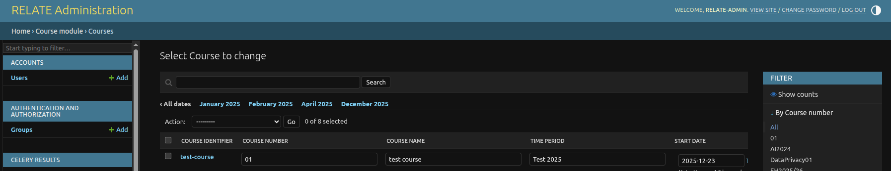

# Before installing

 This Helm chart expects you to have the following Helm charts installed:

 - https://cloudnative-pg.github.io/charts
 - https://github.com/bitnami/charts/tree/master/bitnami/rabbitmq-cluster-operator

 AND you need to have a working mail server to point it to.
 - IF you do not have one - you can use this chart to setup a mailrelay service in your Kubernetes cluster: https://github.com/bokysan/docker-postfix/blob/master/helm/mail

 and currently no image is pushed to any dockerhub - so you need to do that - and point to it.

For additional configuration options for social authentication using Python, refer to these docs. These changes should be made in the ``local_settings_template.py`` file present in ``docker`` folder. currently it is configured to use keycloak authentication.
- https://python-social-auth.readthedocs.io/en/latest/backends/keycloak.html
- https://python-social-auth.readthedocs.io/en/latest/configuration/settings.html#urls-options

# After installing

After spinning up relate - you need to open a shell in the relate pod and run this to create your initial admin user:
```
uv run python manage.py createsuperuser --username=youradminuser
```

## Backups and Recovery

### PostgreSQL backups

* PostgreSQL backups must be handled using **CloudNativePG (CNPG) backups**.
* This is the **primary and supported backup mechanism** for the database at this time.
* Follow on this https://github.com/Obmondo/KubeAid/blob/master/argocd-helm-charts/cloudnative-pg/readme.md#backup

---

#### Restore procedure

* Restore using https://github.com/Obmondo/KubeAid/blob/master/argocd-helm-charts/cloudnative-pg/readme.md#recovery 
* Additionally, You need to replicate The course repositories that located inside the **Relate pod** under:

  ```
  /var/www/relate/git-roots
  ```

1. Identify the **course identifier**.

2. Create a directory named after the course identifier.
3. `cd` into that directory.
4. Clone the corresponding course repository using the same private key added for the course:

   ```bash
   git clone <course-repo-url>
   ```
5. Retain only the `.git` directory and remove all other files from the working tree.

