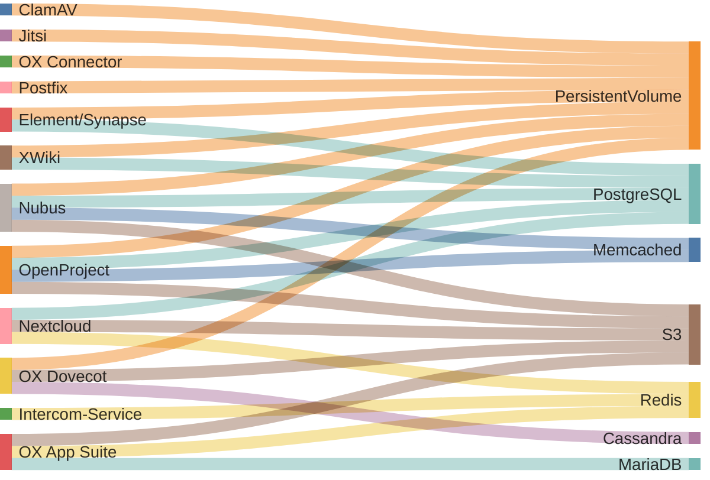

<!--
SPDX-FileCopyrightText: 2024 Zentrum für Digitale Souveränität der Öffentlichen Verwaltung (ZenDiS) GmbH
SPDX-License-Identifier: Apache-2.0
-->

<h1>Application Data Storages</h1>

To provide a feasible backup and restore concept, a thorough overview of all openDesk
applications and their related data storages (ephemeral & persistent) is provided in the
following subsection.

<!-- TOC -->
* [Overview](#overview)
* [Details](#details)
<!-- TOC -->

# Overview

The provided diagram shows all relevant openDesk applications on the left and
their utilized data storages on the right. For more detailed information about each
application refer to the table in [Details](#details).

# Details

| Application          | Data Storage | Backup   | Content                                                                           | (Default) Identifier                           | Details                                                                                                   |
| -------------------- | ------------ | -------- | --------------------------------------------------------------------------------- | ---------------------------------------------- | --------------------------------------------------------------------------------------------------------- |
| **ClamAV**           | PVC          | No       | ClamAV Database                                                                   | `clamav-database-clamav-simple-0`              | `/var/lib/clamav`                                                                                         |
| **Dovecot**          | PVC          | Yes      | openDesk CE only: User mail directories                                           | `dovecot`                                      | `/srv/mail`                                                                                               |
|                      | PVC          | Yes       | openDesk EE only: Metacache directory                                             | `var-lib-dovecot-dovecot-0`                    | `/var/lib/dovecot`                                                                                        |
|                      | S3           | Yes      | openDesk EE only: User mail                                                       | `dovecot`                                      | `dovecot`                                                                                                 |
|                      | Cassandra    | Yes      | openDesk EE only: Metadata and ACLs                                               | `dovecot_dictmap`, `dovecot_acl`               |                                                                                                           |
| **Element/Synapse**  | PostgreSQL   | Yes      | Application's main database                                                       | `matrix`                                       |                                                                                                           |
|                      | PVC          | Yes      | Attachments                                                                       | `media-opendesk-synapse-0`                     | `/media`                                                                                                  |
|                      |              | Yes      | Sync and state data                                                               | `matrix-neodatefix-bot`                        | `/app/storage`                                                                                            |
| **Intercom-Service** | Redis        | No       | Shared session data                                                               |                                                |                                                                                                           |
| **Jitsi**            | PVC          | Optional | Meeting recordings (feature not enabled in openDesk)                              | `prosody-data-jitsi-prosody-0`                 | `/config/data`                                                                                            |
| **Nextcloud**        | PostgreSQL   | Yes      | Application's main database Meta-Data                                             | `nextcloud`                                    |                                                                                                           |
|                      | S3           | Yes      | The Nextcloud managed user files                                                  | `nextcloud`                                    |                                                                                                           |
|                      | Redis        | No       | Distributed caching, as well as transactional file locking                        |                                                |                                                                                                           |
| **Nubus**            | PostgreSQL   | Yes      | Main database for Nubus' IdP Keycloak                                             | `keycloak`                                     |                                                                                                           |
|                      |              | Yes      | Login actions and device-fingerprints                                             | `keycloak_extensions`                          |                                                                                                           |
|                      |              | Optional | Store of the temporary password reset token                                       | `selfservice`                                  |                                                                                                           |
|                      |              | Optional | OIDC session storage                                                              | `umsAuthSession`                               |                                                                                                           |
|                      |              | No       | At the moment the notification feature not enabled in openDesk                    | `notificationsapi`                             |                                                                                                           |
|                      |              | No       | At the moment the Guardian features are currently not enabled in openDesk         | `guardianmanagementapi`                        |                                                                                                           |
|                      | S3           | No       | Static files for Portal                                                           | `ums`                                          |                                                                                                           |
|                      | PVC          | Yes      | openLDAP database (primary R/W Pods), when restore select the one from the leader | `shared-data-ums-ldap-server-primary-0`        | `/var/lib/univention-ldap`                                                                                |
|                      |              | Yes      | openLDAP process data                                                             | `shared-run-ums-ldap-server-primary-0`         | `/var/run/slapd`                                                                                          |
|                      |              | No       | openLDAP database (secondary R/O Pods), secondaries can sync from the primary     | `shared-data-ums-ldap-server-secondary-0`      | `/var/lib/univention-ldap`                                                                                |
|                      |              | No       | openLDAP process data                                                             | `shared-run-ums-ldap-server-secondary-0`       | `/var/run/slapd`                                                                                          |
|                      |              | Yes      | The state of the listener                                                         | `data-ums-provisioning-udm-listener-0`         | `/var/log/univention` `/var/lib/univention-ldap/schema/id` `/var/lib/univention-directory-listener` |
|                      |              | No       | Cache                                                                             | `group-membership-cache-ums-portal-consumer-0` | `/usr/share/univention-group-membership-cache/caches`                                                     |
|                      |              | Yes      | Queued provisioning objects                                                       | `nats-data-ums-provisioning-nats-0`            | `/data`                                                                                                   |
|                      | Memcached    | No       | Cache for UMC Server                                                              |                                                |                                                                                                           |
| **OpenProject**      | PostgreSQL   | Yes      | Application's main database                                                       | `openproject`                                  |                                                                                                           |
|                      | S3           | Yes      | Attachments, custom styles                                                        | `openproject`                                  |                                                                                                           |
|                      | Memcached    | No       | Cache                                                                             |                                                |                                                                                                           |
|                      | PVC          | No       | PVC backed `emptyDir` as K8s cannot set the sticky bit on standard emptyDirs      | `openproject-<web/worker>-*-tmp`               | `/tmp`                                                                                                    |
|                      |              | No       | PVC backed `emptyDir` as K8s cannot set the sticky bit on standard emptyDirs      | `openproject-<web/worker>-app-*-tmp`           | `/app/tmp`                                                                                                |
| **OX App Suite**     | MariaDB      | Yes      | Application's control database to coordiate dynamically created ones              | `configdb`                                     |                                                                                                           |
|                      |              | Yes      | Dynamically creates databases of schema `PRIMARYDB_n`containing multiple contexts | `PRIMARYDB_*`                                  |                                                                                                           |
|                      |              | Yes      | OX Guard related settings                                                         | `oxguard*`                                     |                                                                                                           |
|                      | S3           | Yes      | Attachments of meetings, contacts and tasks                                       | `openxchange`                                  |                                                                                                           |
|                      | Redis        | Optional | Cache, session related data, distributed maps                                     |                                                |                                                                                                           |
| **OX Connector**     | PVC          | Optional | OX Connector: Caching of OX object data                                           | for backup                                     | `/var/lib/univention-appcenter/apps/ox-connector`                                                         |
|                      |              | Yes      | OX Connector: OX SOAP API credentials                                             | `ox-connector-ox-contexts-ox-connector-0`      | `/etc/ox-secrets`                                                                                         |
| **OX Dovecot**       | PVC          | Yes      | openDesk CE only: User mail directories                                           | `dovecot`                                      | `/srv/mail`                                                                                               |
|                      | PVC          | Yes      | openDesk EE only: Various meta data and caches                                    | `var-lib-dovecot`                              | `/var/lib/dovecot`                                                                                        |
|                      | S3           | Yes      | Dovecot Pro/openDesk EE only: User mail                                           | `dovecot`                                      | `dovecot`                                                                                                 |
|                      | Cassandra    | Yes      | Dovecot Pro/openDesk EE only: Metadata and ACLs                                   | `dovecot_dictmap`, `dovecot_acl`               |                                                                                                           |
| **Postfix**          | PVC          | Yes      | Mail spool                                                                        | `postfix`                                      | `/var/spool/postfix`                                                                                      |
| **XWiki**            | PostgreSQL   | Yes      | Application's main database                                                       | `xwiki`                                        |                                                                                                           |
|                      | PVC          | Yes      | Attachments                                                                       | `xwiki-data-xwiki-0`                           | `/usr/local/xwiki/data`                                                                                   |

Additionally, the following persistent volumes are mounted by Pods that serve as a data storage for the applications mentioned above.

These services are not ment for production use, so you can ignore these as you surely backup your production services instead.

| Service    | Pod              | Volume Name  | PVC                         | MountPath             | Comment          |
|------------|------------------|--------------|-----------------------------|-----------------------|------------------|
| MariaDB    | `mariadb-*`      | `data`       | `data-mariadb-0`            | `/var/lib/mysql`      |                  |
| MinIO      | `minio-*-*`      | `data`       | `minio`                     | `/bitnami/minio/data` |                  |
| PostgreSQL | `postgresql-*`   | `data`       | `data-postgresql-0`         | `/mnt/postgresql`     |                  |
| Redis      | `redis-master-*` | `redis-data` | `redis-data-redis-master-0` | `/data`               |                  |
| Cassandra  | `cassandra-*`    | `data`       | `data-cassandra-*`          | `/bitnami/cassandra`  | openDesk EE only |
