# KubeAid Cluster Design Guide

## Overview

This document describes the design principles, architectural decisions, and best practices for Kubernetes clusters managed with KubeAid. It covers:

1. Control plane architecture and security isolation
2. Storage strategies (Cloud CSI vs Local PV vs Ceph)
3. High availability patterns for stateful workloads
4. Cloud provider considerations and limitations

---

## Table of Contents

- [Cluster Architecture Patterns](#cluster-architecture-patterns)
- [Control Plane Design](#control-plane-design)
- [Storage Design](#storage-design)
- [Database High Availability Strategies](#database-high-availability-strategies)
- [Cloud Provider Considerations](#cloud-provider-considerations)
- [Quick Decision Matrix](#quick-decision-matrix)

---

## Cluster Architecture Patterns

### Standard Production Cluster

```mermaid
graph LR
    subgraph CP["🔐 CONTROL PLANE"]
        direction TB
        CP1["<b>CP-1</b><br/>ARM64 Ampere<br/>──────────<br/>etcd ∙ apiserver<br/>scheduler ∙ controller"]
        CP2["<b>CP-2</b><br/>ARM64 Ampere<br/>──────────<br/>etcd ∙ apiserver<br/>scheduler ∙ controller"]
        CP3["<b>CP-3</b><br/>ARM64 Ampere<br/>──────────<br/>etcd ∙ apiserver<br/>scheduler ∙ controller"]
    end

    subgraph WK["⚙️ WORKER NODES"]
        direction TB
        W1["<b>Worker-1</b><br/>AMD64<br/>──────────<br/>App Pods<br/>Databases"]
        W2["<b>Worker-2</b><br/>AMD64<br/>──────────<br/>App Pods<br/>Ceph OSD"]
        W3["<b>Worker-3</b><br/>AMD64<br/>──────────<br/>App Pods<br/>Ceph OSD"]
        W4["<b>Worker-N</b><br/>AMD64<br/>──────────<br/>Scale as<br/>needed..."]
    end

    CP ===|"🚫 Taint: NoSchedule"| WK

    style CP fill:#1e3a5f,stroke:#60a5fa,stroke-width:3px,color:#fff
    style WK fill:#14532d,stroke:#4ade80,stroke-width:3px,color:#fff
    style CP1 fill:#1e40af,stroke:#93c5fd,stroke-width:2px,color:#fff
    style CP2 fill:#1e40af,stroke:#93c5fd,stroke-width:2px,color:#fff
    style CP3 fill:#1e40af,stroke:#93c5fd,stroke-width:2px,color:#fff
    style W1 fill:#166534,stroke:#86efac,stroke-width:2px,color:#fff
    style W2 fill:#166534,stroke:#86efac,stroke-width:2px,color:#fff
    style W3 fill:#166534,stroke:#86efac,stroke-width:2px,color:#fff
    style W4 fill:#166534,stroke:#86efac,stroke-width:2px,color:#fff,stroke-dasharray: 5 5
```



**Key Design Principles:**

| Component | Architecture | Purpose |
|-----------|--------------|---------|
| **Control Plane** | 3× ARM64 (Ampere) | Dedicated cluster management, cost-effective |
| **Worker Nodes** | N× AMD64 | Application workloads, scalable |
| **Taint** | `NoSchedule` | Prevents workloads on control plane |

---

## Control Plane Design

### Dedicated Controllers with ARM64 (Ampere)

**Why use dedicated control plane nodes?**

| Benefit | Description |
|---------|-------------|
| **Security Isolation** | Workloads cannot access control plane components directly |
| **Resource Protection** | Control plane has guaranteed resources, no OOM from workloads |
| **Stability** | Misbehaving applications cannot crash the cluster |
| **Attack Surface Reduction** | Compromised workload cannot easily pivot to etcd/apiserver |

**Why ARM64 (Ampere) for control planes?**

| Benefit | Description |
|---------|-------------|
| **Cost Effective** | ARM servers are typically 20-40% cheaper than x86 equivalents |
| **Lower Power** | Better power efficiency for always-on control plane |
| **Security Boundary** | Different architecture = harder to exploit from x86 workloads |
| **Right-Sized** | Control plane doesn't need heavy compute, ARM is sufficient |

### Control Plane Taints (CRITICAL)

Control plane nodes **MUST** have taints to prevent workload scheduling:

```yaml
# Required taint on all control plane nodes
taints:
  - key: node-role.kubernetes.io/control-plane
    effect: NoSchedule
```

**Verify taints are in place:**

```bash
kubectl get nodes -l node-role.kubernetes.io/control-plane -o custom-columns=NAME:.metadata.name,TAINTS:.spec.taints
```

**Add missing taints:**

```bash
kubectl taint nodes <control-plane-node> node-role.kubernetes.io/control-plane:NoSchedule --overwrite
```

### ⚠️ Risks of NOT Having Dedicated Controllers

| Risk | Impact | Severity |
|------|--------|----------|
| **OOM Kills** | Workload pods consume memory, causing control plane OOM | 🔴 Critical |
| **CPU Starvation** | Scheduler/controller-manager become slow or unresponsive | 🔴 Critical |
| **etcd Latency** | Disk I/O from workloads impacts etcd performance | 🔴 Critical |
| **Security Breach** | Compromised pod can access etcd data/apiserver | 🔴 Critical |
| **Cluster Instability** | Random failures, kubectl timeouts, deployment failures | 🟡 High |

**Real-world example:** When worker nodes are full (e.g., volume limit reached), pods may get scheduled on control plane nodes if taints are removed, causing OOM kills and cluster instability.

---

## Storage Design

### Storage Types Comparison

| Storage Type | Failover | Per-Node Limit | HA Strategy | Best For |
|--------------|----------|----------------|-------------|----------|
| **Hetzner CSI** | ✅ Automatic | ❌ 16 volumes | Single replica DB | Small/Dev clusters |
| **AWS EBS** | ✅ Automatic | ❌ 28 volumes | Single replica DB | AWS workloads |
| **Azure Disk** | ✅ Automatic | ❌ Varies | Single replica DB | Azure workloads |
| **Local PV** | ❌ None | ✅ Unlimited | Multi-replica DB | HA databases |
| **Ceph (Rook)** | ✅ Automatic | ✅ Unlimited | Single replica DB | Production clusters |

### Storage Decision Tree

```mermaid
flowchart TD
    start(["🤔 What type of cluster?"]) --> dev{"Development?"}
    start --> small{"Small Production?"}
    start --> large{"Large Production?"}
    
    dev -->|Yes| devChoice["☁️ Cloud CSI<br/>Hetzner/AWS/Azure"]
    devChoice --> devDB["📊 DB: 1 replica"]
    
    small -->|Yes| smallChoice["☁️ Cloud CSI or<br/>💾 Ceph"]
    smallChoice --> smallDB["📊 DB: 1 replica<br/>Storage handles HA"]
    
    large -->|Yes| largeChoice["💾 Use Ceph<br/>Rook Operator"]
    largeChoice --> largeDB["📊 DB: 1 replica<br/>Storage handles HA"]
    
    priority["🎯 KISS Principle:<br/>Fewer options = Less complexity<br/>Easier debugging in production"] 
    
    style start fill:#4a5568,stroke:#a0aec0,stroke-width:2px,color:#fff
    style devChoice fill:#3182ce,stroke:#63b3ed,color:#fff
    style smallChoice fill:#805ad5,stroke:#b794f4,color:#fff
    style largeChoice fill:#38a169,stroke:#68d391,color:#fff
    style devDB fill:#2c5282,stroke:#4299e1,color:#fff
    style smallDB fill:#553c9a,stroke:#9f7aea,color:#fff
    style largeDB fill:#276749,stroke:#48bb78,color:#fff
    style priority fill:#1a202c,stroke:#f6ad55,stroke-width:2px,color:#f6ad55
```



### Design Philosophy: Why We Keep It Simple (KISS)

We intentionally limit supported storage solutions to **Cloud CSI** and **Ceph**.

**Why not support other options?**
> "Too much choice just means too many combinations and options for problems in production."

1.  **Maturity Wins**: Ceph is the industry standard for self-hosted Kubernetes storage. It is battle-tested at massive scale.
2.  **Reduced Complexity**: By standardizing on fewer, better tools, we reduce the "surface area" for bugs.
3.  **Easier Debugging**: When things fail (and they will), having a simple, well-understood stack makes recovery faster.
4.  **Production Safety**: We prioritize stability and data integrity over "easy setup" solutions.

**Our Rule:** If it's not rock-solid for production, it's not in KubeAid.

### Hetzner CSI Limitations

⚠️ **Critical Limitation:** Each Hetzner Cloud server can only attach **16 volumes maximum**.

This is a hardware limitation of Hetzner Cloud (HCloud) servers, not the CSI driver:
- [GitHub Issue #240](https://github.com/hetznercloud/csi-driver/issues/240)

**Impact:**

| Scenario | Volumes Used | Issues |
|----------|--------------|--------|
| 5 Odoo instances (Odoo PV + 2 PG replicas each) | 5 × 3 = 15 volumes | ⚠️ Almost at limit |
| 6 Odoo instances | 18 volumes | ❌ Exceeds limit |
| Add monitoring/logging PVs | +2-4 volumes | ❌ No capacity |

**Solutions:**

1. **Short-term:** Reduce database replicas to 1 (see below)
2. **Medium-term:** Add more worker nodes
3. **Long-term:** Migrate to Ceph storage (no per-node limit)

---

## Database High Availability Strategies

### The Key Principle

> **Use database-level replication (2+ replicas) ONLY when using local storage.**
> **Use single replica when storage provides failover (cloud CSI, Ceph).**

### Why This Matters

| Storage Type | Failover Mechanism | DB Replicas Needed | Reason |
|--------------|-------------------|-------------------|--------|
| **Local PV** | ❌ None | 2+ replicas | Data loss if node fails |
| **Hetzner CSI** | ✅ Volume reattaches | 1 replica | Volume moves to new node |
| **Ceph** | ✅ Data replicated 3x | 1 replica | Storage handles HA |
| **AWS EBS** | ✅ AZ-level redundancy | 1 replica | Storage handles HA |

### When Do You Actually Need Read Replicas?

> 💡 **Key Insight:** Read replicas are for **performance scaling**, not for HA when using failover-capable storage.

| Scenario | Need Read Replicas? | Reason |
|----------|--------------------|---------|
| **Read-heavy workload** (10,000+ queries/sec) | ✅ Yes | Distribute read load |
| **HA with cloud storage** | ❌ No | Storage handles failover |
| **HA with local storage** | ✅ Yes | No storage-level failover |
| **Small/Medium apps** | ❌ No | Single instance sufficient |
| **Backups available** | ❌ No | Can restore from backup |

**Real-world example:** None of our current workloads (Obmondo, Image2Work) have the scale requiring read replicas. Backups + failover storage provides sufficient data protection.

### Backups vs Replicas

```mermaid
graph LR
    subgraph with_replica["❌ With Read Replica"]
        direction TB
        r1["2 volumes used"]
        r2["2x CPU/Memory"]
        r3["Hits volume limits"]
    end
    
    subgraph with_backup["✅ With Backups Only"]
        direction TB
        b1["1 volume used"]
        b2["1x CPU/Memory"]
        b3["Backup to S3/SeaweedFS"]
    end
    
    with_replica ---|"vs"| with_backup
    
    style with_replica fill:#742a2a,stroke:#fc8181,color:#fff
    style with_backup fill:#22543d,stroke:#68d391,color:#fff
```



**Recommendation:** Use scheduled backups (to SeaweedFS/S3) instead of read replicas for data protection.

### Visual Comparison

#### ❌ Wrong: 2 PG Replicas with Cloud Storage (Wastes Resources)

```mermaid
flowchart TB
    subgraph storage["☁️ Hetzner CSI Storage"]
        note1["Already has failover!"]
    end
    
    storage --> pvc1
    storage --> pvc2
    
    subgraph db["PostgreSQL Cluster"]
        pvc1[("📀 PVC 1")] --> master["🐘 PG Master"]
        pvc2[("📀 PVC 2")] --> replica["🐘 PG Replica"]
        master <-->|"Streaming<br/>Replication"| replica
    end
    
    subgraph problems["❌ Problems"]
        p1["Uses 2 volume slots<br/>Limited to 16 per node"]
        p2["Replica provides no<br/>additional HA"]
        p3["Wastes CPU/Memory"]
    end

    style storage fill:#c53030,stroke:#fc8181,stroke-width:2px,color:#fff
    style db fill:#742a2a,stroke:#fc8181,color:#fff
    style problems fill:#1a202c,stroke:#fc8181,color:#fc8181
    style master fill:#9b2c2c,stroke:#feb2b2,color:#fff
    style replica fill:#9b2c2c,stroke:#feb2b2,color:#fff
```



#### ✅ Correct: 1 PG Instance with Cloud Storage

```mermaid
flowchart TB
    subgraph storage["☁️ Hetzner CSI Storage"]
        note1["Automatic failover!"]
    end
    
    storage --> pvc1
    
    subgraph db["PostgreSQL"]
        pvc1[("📀 PVC 1")] --> master["🐘 PG Master"]
    end
    
    subgraph benefits["✅ Benefits"]
        b1["Uses only 1 volume slot"]
        b2["Storage handles failover<br/>automatically"]
        b3["Saves CPU/Memory"]
    end

    style storage fill:#276749,stroke:#68d391,stroke-width:2px,color:#fff
    style db fill:#22543d,stroke:#68d391,color:#fff
    style benefits fill:#1a202c,stroke:#68d391,color:#68d391
    style master fill:#2f855a,stroke:#9ae6b4,color:#fff
```



#### ✅ Correct: 2 PG Replicas with Local Storage

```mermaid
flowchart TB
    subgraph node1["🖥️ Node 1"]
        disk1[("💾 Local NVMe")] --> master["🐘 PG Master"]
    end
    
    subgraph node2["🖥️ Node 2"]
        disk2[("💾 Local NVMe")] --> replica["🐘 PG Replica"]
    end
    
    master <-->|"Streaming<br/>Replication"| replica
    
    subgraph benefits["✅ Benefits"]
        b1["If Node 1 dies →<br/>Promote replica on Node 2"]
        b2["No data loss<br/>Replica has copy"]
        b3["No volume limits<br/>Local storage"]
    end

    style node1 fill:#2c5282,stroke:#63b3ed,stroke-width:2px,color:#fff
    style node2 fill:#2c5282,stroke:#63b3ed,stroke-width:2px,color:#fff
    style benefits fill:#1a202c,stroke:#68d391,color:#68d391
    style master fill:#3182ce,stroke:#90cdf4,color:#fff
    style replica fill:#3182ce,stroke:#90cdf4,color:#fff
    style disk1 fill:#4a5568,stroke:#a0aec0,color:#fff
    style disk2 fill:#4a5568,stroke:#a0aec0,color:#fff
```



### PostgreSQL Configuration Examples

#### Cloud Storage (Hetzner CSI, AWS EBS, Ceph)

```yaml
# values.yaml for PostgreSQL operator
postgres:
  instance: 1  # Single instance - storage handles HA
  storage:
    storageClass: hcloud-volumes  # or ceph-block, gp3, etc.
    size: 10Gi
```

#### Local Storage (Bare Metal, Local PV)

```yaml
# values.yaml for PostgreSQL operator
postgres:
  instance: 2  # Two instances for HA - storage has no failover
  storage:
    storageClass: local-path
    size: 100Gi
```

---

## Resource Management Best Practices

### Memory Limits vs Requests

> ⚠️ **CRITICAL:** Never reduce memory **limits** to save resources. Only adjust **requests**.

| Setting | Purpose | Safe to Reduce? |
|---------|---------|----------------|
| **Memory Request** | Scheduling guarantee | ✅ Yes (carefully) |
| **Memory Limit** | OOM kill threshold | ❌ **NO** |
| **CPU Request** | Scheduling guarantee | ✅ Yes |
| **CPU Limit** | Throttling threshold | ⚠️ Careful |

**Why this matters:**


### Resource Configuration Guidelines

```yaml
# ✅ CORRECT: High limit, lower request
resources:
  requests:
    memory: "256Mi"   # Can be reduced for scheduling
    cpu: "100m"
  limits:
    memory: "512Mi"   # Keep this high - prevents OOMKilled
    cpu: "500m"

# ❌ WRONG: Low limit causes OOMKilled
resources:
  requests:
    memory: "256Mi"
    cpu: "100m"
  limits:
    memory: "256Mi"   # Too low - will get OOMKilled!
    cpu: "500m"
```

### Monitoring Resource Usage

```bash
# Check actual node memory usage
kubectl top nodes

# Check pod memory usage
kubectl top pods --all-namespaces --sort-by=memory

# Find OOMKilled pods
kubectl get pods --all-namespaces -o json | jq -r '
  .items[] | 
  select(.status.containerStatuses[]?.lastState.terminated.reason=="OOMKilled") | 
  "\(.metadata.namespace)/\(.metadata.name)"'
```

---

## Cloud Provider Considerations

### Hetzner Cloud (HCloud)

| Aspect | Details | Impact |
|--------|---------|--------|
| **Volume Limit** | 16 volumes per server | Plan capacity carefully |
| **Volume Failover** | ✅ Automatic reattachment | Use single DB replica |
| **Stability** | Occasional API timeouts | May cause PV attach delays |
| **Cost** | Low | Good for dev/small prod |

**Recommended for:** Development clusters, small production workloads

**When to move away:** When approaching volume limits, large production workloads

### Hetzner Bare Metal (Dedicated) - Recommended for Production

| Aspect | Details | Impact |
|--------|---------|--------|
| **Volume Limit** | ✅ No cloud volume limit | Use local PV or Ceph |
| **Local Storage** | Fast NVMe/SSD | Great for databases |
| **Ceph** | ✅ Recommended | No per-node limits |
| **Network** | 10G NIC available | Fast Ceph replication |
| **Cost** | Higher | Better for production |

#### Recommended Hardware: AX52

| Component | Specification | Purpose |
|-----------|---------------|---------|
| **CPU** | AMD Ryzen 9 5950X (16c/32t) | High-performance workloads |
| **RAM** | 128 GB DDR4 ECC | Large memory for apps + Ceph |
| **Storage** | 2× 3.84 TB NVMe | Ceph OSD + Local PV |
| **Network** | **10 Gbps NIC** | Fast Ceph replication, low latency |

```mermaid
graph TB
    subgraph cluster["🏭 Production Cluster on Dedicated Servers"]
        subgraph cp["🔐 Control Plane (3× CAX41 ARM64)"]
            cp1["CP-1<br/>Ampere"]
            cp2["CP-2<br/>Ampere"]
            cp3["CP-3<br/>Ampere"]
        end
        
        subgraph workers["⚙️ Workers (3× AX52 + 10G NIC)"]
            w1["Worker-1<br/>Ceph OSD<br/>Apps"]
            w2["Worker-2<br/>Ceph OSD<br/>Apps"]
            w3["Worker-3<br/>Ceph OSD<br/>Apps"]
        end
        
        subgraph storage["💾 Ceph Cluster"]
            ceph["Distributed Storage<br/>3× Replicated<br/>No Volume Limits"]
        end
    end
    
    w1 <-->|"10G"| ceph
    w2 <-->|"10G"| ceph
    w3 <-->|"10G"| ceph

    style cluster fill:#1a202c,stroke:#4a5568,color:#fff
    style cp fill:#1e3a5f,stroke:#60a5fa,stroke-width:2px,color:#fff
    style workers fill:#14532d,stroke:#4ade80,stroke-width:2px,color:#fff
    style storage fill:#553c9a,stroke:#b794f4,stroke-width:2px,color:#fff
```



**Why 10G NIC?**
- Ceph replication requires high bandwidth between nodes
- Reduces latency for distributed storage operations
- Enables fast recovery when OSD fails
- Critical for production databases

**Recommended for:** Production clusters, Image2Work prod, stateful workloads at scale

### Comparison Matrix

```mermaid
flowchart LR
    subgraph scale["📊 Production Readiness Scale"]
        direction LR
        dev["🧪 Dev/Small"] --> med["🏢 Medium"] --> large["🏭 Large/Critical"]
    end
    
    subgraph options["Infrastructure Options"]
        hcloud["☁️ Hetzner Cloud + CSI"] -.->|"Limited"| dev
        bare["🖥️ Hetzner Bare Metal + Ceph"] -->|"✅"| dev
        bare -->|"✅"| med
        bare -->|"✅"| large
        cloud["☁️ AWS/Azure/GCP + Managed"] -->|"✅"| dev
        cloud -->|"✅"| med
        cloud -->|"✅"| large
    end

    style scale fill:#1a202c,stroke:#4a5568,color:#fff
    style options fill:#2d3748,stroke:#4a5568,color:#fff
    style dev fill:#3182ce,stroke:#63b3ed,color:#fff
    style med fill:#805ad5,stroke:#b794f4,color:#fff
    style large fill:#38a169,stroke:#68d391,color:#fff
    style hcloud fill:#ed8936,stroke:#fbd38d,color:#fff
    style bare fill:#38a169,stroke:#68d391,color:#fff
    style cloud fill:#667eea,stroke:#a3bffa,color:#fff
```



> **Key Insight:** Hetzner Cloud CSI is suitable for dev/small workloads but hits limitations (16 volumes/node) for larger deployments. Migrate to Ceph on bare metal for production scale.

---

## Quick Decision Matrix

### Storage Selection

| Question | If Yes | If No |
|----------|--------|-------|
| Over 10 stateful applications? | Use Ceph | Cloud CSI may work |
| Need >16 volumes per node? | Use Ceph/Local PV | Cloud CSI OK |
| Using Hetzner dedicated servers? | Use Ceph | N/A |
| Production-critical data? | Use Ceph with 3x replication | Cloud CSI acceptable |

### Database Replica Count

| Storage Type | Use 1 Replica | Use 2+ Replicas |
|--------------|---------------|-----------------|
| Hetzner CSI | ✅ | ❌ |
| AWS EBS/EFS | ✅ | ❌ |
| Azure Disk | ✅ | ❌ |
| Ceph (Rook) | ✅ | ❌ |
| Local PV | ❌ | ✅ |
| hostPath | ❌ | ✅ |

### Control Plane Configuration

| Environment | Dedicated CP? | ARM64 CP? | Taints? |
|-------------|---------------|-----------|---------|
| Development | Optional | Optional | ✅ Required |
| Staging | ✅ Recommended | Optional | ✅ Required |
| Production | ✅ Required | ✅ Recommended | ✅ Required |

---

## Configuration Examples

### Recommended: Production Cluster on Hetzner

```yaml
# Cluster configuration
controlPlane:
  count: 3
  machineType: cax31          # ARM64 Ampere
  taints:
    - key: node-role.kubernetes.io/control-plane
      effect: NoSchedule

workers:
  count: 3+                    # Scale based on workload
  machineType: cpx41           # AMD64 for compatibility

storage:
  # For small clusters
  primary: hcloud-volumes
  # For larger clusters - add Ceph
  # primary: rook-ceph-block

databases:
  postgresql:
    instances: 1               # Single instance - CSI handles failover
    storageClass: hcloud-volumes
```

### Recommended: Production Cluster on Bare Metal

```yaml
# Cluster configuration
controlPlane:
  count: 3
  hardware: AX41-NVMe          # Dedicated servers
  taints:
    - key: node-role.kubernetes.io/control-plane
      effect: NoSchedule

workers:
  count: 3+
  hardware: AX41               # With Ceph OSD disks

storage:
  primary: rook-ceph-block     # Ceph for all persistent storage

databases:
  postgresql:
    instances: 1               # Single instance - Ceph handles failover
    storageClass: rook-ceph-block
```

---

## Troubleshooting Common Issues

### "Pods scheduled on control plane"

**Cause:** Missing taints on control plane nodes

**Fix:**
```bash
kubectl taint nodes <cp-node> node-role.kubernetes.io/control-plane:NoSchedule
```

### "Cannot schedule pod - volume limit reached"

**Cause:** Hetzner CSI 16-volume limit

**Fix:**
1. Reduce DB replicas: `postgres.instance: 1`
2. Add more worker nodes
3. Migrate to Ceph storage

See: [Hetzner CSI Volume Limit Debugging](../guides/storage/hetzner/hetzner-csi-volume-limit-debugging.md)

### "Database not recovering after node failure"

**Cause:** Using local PV with single replica

**Fix:** With local PV, use 2+ replicas:
```yaml
postgres:
  instance: 2
```

---

## Related Documentation

**Hetzner Storage Guides:**
- [Hetzner CSI Volume Limit Debugging](https://gitea.obmondo.com/EnableIT/wiki/src/branch/master/guides/storage/hetzner/hetzner-csi-volume-limit-debugging.md) - 16 volumes/node limit
- [Hetzner Block Storage Debugging](https://gitea.obmondo.com/EnableIT/wiki/src/branch/master/guides/storage/hetzner/hetzner-block-storage-debugging.md) - Volume mount issues

**Alert Handling:**
- [KubeContainerWaiting](https://gitea.obmondo.com/EnableIT/wiki/src/branch/master/procedures/alerts/KubeContainerWaiting.md) - Pods stuck in ContainerCreating
- [KubePodNotReady](https://gitea.obmondo.com/EnableIT/wiki/src/branch/master/procedures/alerts/KubePodNotReady.md) - Pod scheduling issues

**Application Guides:**
- [CSS/JS Asset Loading Failures](https://gitea.obmondo.com/EnableIT/wiki/src/branch/master/guides/debugging/css-js-asset-loading-failures.md) - Volume path mismatches

---

## Summary

| Design Decision | Recommendation |
|-----------------|----------------|
| Control Plane | Dedicated ARM64 nodes with `NoSchedule` taint |
| Storage (HCloud) | Hetzner CSI for small, Ceph for large |
| Storage (Bare Metal) | Always Ceph |
| DB Replicas (Cloud Storage) | 1 replica (storage handles failover) |
| DB Replicas (Local PV) | 2+ replicas (application-level HA) |
| Volume Planning | Max 16/node with Hetzner CSI |

---