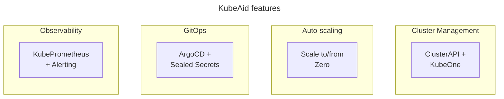

# Getting Started with KubeAid

This guide walks you through the complete process of setting up and managing a KubeAid-managed Kubernetes cluster. The workflow is **provider-agnostic** and the steps are the same whether you're deploying on AWS, Azure, Hetzner, bare metal, or locally.

## Overview

KubeAid is a **Kubernetes management suite** that helps you set up and operate Kubernetes clusters following **GitOps principles**.



All KubeAid clusters include:

- **Cilium CNI** - running in kube-proxyless mode  
- **ArgoCD** - for GitOps-based deployments  
- **Sealed Secrets** - for secure secret management  
- **KubePrometheus** - for monitoring and alerting  
- **ClusterAPI** - for cluster lifecycle management (providers with API access)  
- **KubeOne** - for cluster initialization (SSH-only access platforms)

## Installation Steps

Follow these steps in order to set up your cluster:

| Step | Document | Description |
|------|----------|-------------|
| 1 | [Prerequisites](./prerequisites.md) | Verify required tools, repositories, and provider credentials |
| 2 | [Pre-Configuration](./pre-configuration.md) | Generate and configure `general.yaml` and `secrets.yaml` |
| 3 | [Installation](./installation.md) | Bootstrap the cluster using `kubeaid-cli` |
| 4 | [Post-Configuration](./post-configuration.md) | Access dashboards, verify setup, and configure services |

## Cluster Operations

After installation, use these guides for ongoing cluster management:

| Operation | Document | Description |
|-----------|----------|-------------|
| Basic Operations | [Basic Operations](./basic-operations.md) | Basic operations including deletion and clean-up |

## Supported Providers

KubeAid supports the following hosting environments:

| Provider | Type | Autoscaling | Notes |
|----------|------|-------------|-------|
| **AWS** | Cloud (API-managed) | ✅ Scale to/from 0 | Uses ClusterAPI |
| **Azure** | Cloud (API-managed) | ✅ Scale to/from 0 | Uses ClusterAPI |
| **Hetzner HCloud** | Cloud (API-managed) | ✅ Scale to/from 0 | Uses ClusterAPI |
| **Hetzner Bare Metal** | Dedicated servers | ❌ Manual | Uses ClusterAPI |
| **Hetzner Hybrid** | Cloud + Bare Metal | ✅ HCloud only | Uses ClusterAPI |
| **Bare Metal (SSH-only)** | On-premise | ❌ Manual | Uses KubeOne |
| **Local K3D** | Development | ❌ | For testing only |

> **Note:** ClusterAPI is used for providers with API access for host management. KubeOne is used for SSH-only access platforms where there is no API for host management.

## Quick Start

For experienced users, here's the minimal workflow:

```bash
# 1. Install the CLI
KUBEAID_CLI_VERSION=$(curl -s "https://api.github.com/repos/Obmondo/kubeaid-cli/releases/latest" | jq -r .tag_name)
OS=$([ "$(uname -s)" = "Linux" ] && echo "Linux" || echo "Darwin")
CPU_ARCHITECTURE=$([ "$(uname -m)" = "x86_64" ] && echo "amd64" || echo "arm64")
wget "https://github.com/Obmondo/kubeaid-cli/releases/download/${KUBEAID_CLI_VERSION}/kubeaid-cli_${OS}_${CPU_ARCHITECTURE}.tar.gz"
tar -xzf kubeaid-cli_${OS}_${CPU_ARCHITECTURE}.tar.gz
sudo mv kubeaid-cli /usr/local/bin/kubeaid-cli
sudo chmod +x /usr/local/bin/kubeaid-cli
rm kubeaid-cli_${OS}_${CPU_ARCHITECTURE}.tar.gz

# 2. Generate config (replace <provider> with: aws, azure, hetzner hcloud, hetzner bare-metal, hetzner hybrid, bare-metal, local)
kubeaid-cli config generate <provider>

# 3. Edit configuration files
# Edit outputs/configs/general.yaml and outputs/configs/secrets.yaml

# 4. Bootstrap
kubeaid-cli cluster bootstrap

# 5. Access cluster
export KUBECONFIG=./outputs/kubeconfigs/main.yaml
kubectl cluster-info
```
