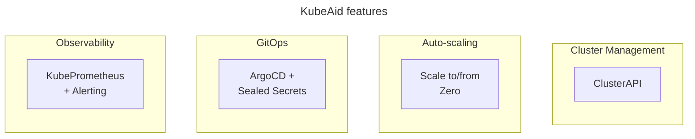

# Your First Kubernetes Cluster with KubeAid

This tutorial walks you through setting up your first KubeAid-managed Kubernetes cluster, from an empty machine to a
running cluster you can operate through Git. The workflow is **provider-agnostic**: the steps are the same whether you
deploy on AWS, Azure, Hetzner, bare metal, or locally.

## What You'll Build

By the end of this tutorial you will have a Kubernetes cluster that is set up and operated following **GitOps
principles**, containing:

- **Cilium CNI** - running in kube-proxyless mode
- **ArgoCD** - for GitOps-based deployments
- **Sealed Secrets** - for secure secret management
- **KubePrometheus** - for monitoring and alerting
- **ClusterAPI** - for cluster lifecycle management


```mermaid
---
title: KubeAid features
---
flowchart LR
    subgraph Obs["Observability"]
        KP["KubePrometheus<br/>+ Alerting"]
    end
    subgraph Git["GitOps"]
        AG["ArgoCD +<br/>Sealed Secrets"]
    end
    subgraph Scale["Auto-scaling"]
        AS["Scale to/from<br/>Zero"]
    end
    subgraph Mgmt["Cluster Management"]
        CM["ClusterAPI"]
    end

    Obs ~~~ Git ~~~ Scale ~~~ Mgmt
```

**How long does it take?** Preparing tools, repositories, and configuration is mostly answering an interactive
prompt; the cluster bootstrap itself typically runs unattended for 10-30 minutes, depending on provider and cluster
size.

## The Journey: Four Steps

Work through these four documents in order. Each one ends where the next begins.

### 1. [Prerequisites](./prerequisites.md)

Get your workstation and accounts ready. You install a handful of standard tools (`kubectl`, `jq`, `yq`, Docker),
create your own kubeaid-config repository from the
[sample template](https://github.com/Obmondo/kubeaid-config), and prepare SSH keys plus any provider-specific
requirements (cloud credentials, SSH keypairs). If you deploy locally with K3D, only the common dependencies
apply.

### 2. [Pre-Configuration](./pre-configuration.md)

Generate the two files that describe your cluster: `general.yaml` (cluster specs, node configs, networking - stored
in your kubeaid-config repo) and `secrets.yaml` (credentials - stored in your password manager, never in Git). An
interactive prompt asks which provider you're targeting and collects everything required, so you review rather than
hand-write the configuration.

### 3. [Installation](./installation.md)

Install `kubeaid-cli` and run a single bootstrap command. The CLI creates a temporary local management cluster,
provisions infrastructure, initializes Kubernetes, installs the core components, and wires ArgoCD to your
kubeaid-config repository. When it finishes, you have a kubeconfig and a running cluster.

### 4. [Post-Configuration](./post-configuration.md)

Verify the cluster is healthy, log in to the ArgoCD and Grafana dashboards, create your first sealed secret, and
decide how you want to receive KubeAid updates going forward. Then do what you built the cluster for: deploy your
own applications — enable a chart from the catalogue or add your own through your kubeaid-config repository, and
ArgoCD rolls it out (see [Adding a New
Application](../kubeaid/helm-umbrella-pattern.md#adding-a-new-application)).

## Choosing Your Platform

**New to KubeAid?** Start with a **local K3D** deployment - it runs in Docker on your machine, costs nothing, and
exercises the exact same four-step flow you would use for AWS/EKS, Azure/AKS, Hetzner, or bare metal. When you move
to a real provider later, only the provider-specific values in your configuration change; the commands stay the same.

| Provider | Type | Autoscaling | Notes |
| ---------- | ------ | ------------- | ------- |
| **AWS** | Cloud (API-managed) | ✅ Scale to/from 0 | Uses ClusterAPI |
| **AWS EKS** | Cloud (managed control plane) | ✅ Scale to/from 0 | CAPA; upgrade via GitOps bump, recover not yet |
| **Azure** | Cloud (API-managed) | ✅ Scale to/from 0 | Uses ClusterAPI |
| **Azure AKS** | Cloud (managed control plane) | ✅ AKS agent pools | CAPZ; upgrade via GitOps bump, recover not yet |
| **Hetzner HCloud** | Cloud (API-managed) | ✅ Scale to/from 0 | Uses ClusterAPI |
| **Hetzner Bare Metal** | Dedicated servers | ❌ Manual | Uses ClusterAPI |
| **Hetzner Hybrid** | Cloud + Bare Metal | ✅ HCloud only | Uses ClusterAPI |
| **Bare Metal (SSH-only)** | On-premise | ❌ Manual | Uses KubeOne |
| **Local K3D** | Development | ❌ | For testing only |

> **Note:** ClusterAPI is used for providers with API access for host management. KubeOne is used for SSH-only access
  platforms where there is no API for host management.

## Quick Start

For experienced users, here's the minimal workflow. The
[KubeAid CLI quick start](https://github.com/Obmondo/kubeaid-cli#quick-start) is the authoritative, always-current
version of this sequence.

```bash
# 1. Install the CLI
curl -fsSL https://raw.githubusercontent.com/Obmondo/kubeaid-cli/main/scripts/install.sh | sh

# 2. Generate general.yaml and secrets.yaml via the interactive prompt
#    (written to ~/.config/kubeaid-cli/<cluster>/configs/)
kubeaid-cli config generate

# 3. Review the generated files, then bootstrap — your only saved cluster is
#    picked automatically (several clusters? add --cluster-name <cluster>)
kubeaid-cli cluster bootstrap

# 4. Access the cluster — bootstrap ends by printing the exact export line
#    for your platform and provider; on Linux it looks like:
export KUBECONFIG=~/.config/kubeaid-cli/<cluster>/kubeconfigs/main.yaml
kubectl cluster-info
```

## Where to Go Next

Once your cluster is running:

| Next Step | Document |
| ----------- | ---------- |
| Day-to-day operations, upgrades, deletion and clean-up | [Basic Operations](./basic-operations.md) |
| Hosting details for cloud providers | [Cloud Providers](../hosting/cloud-providers.md) |
| Hosting details for on-premise servers | [Bare Metal](../hosting/bare-metal.md) |
| Common questions about how KubeAid works | [FAQ](../faq.md) |
| Something not behaving as expected | [Troubleshooting](../troubleshooting.md) |
