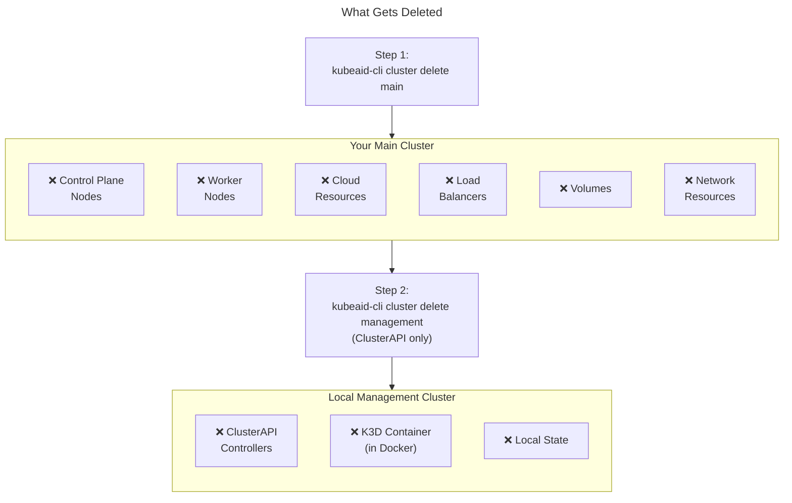

# Basic Operations

This guide covers the essential KubeAid CLI commands for managing your Kubernetes cluster. All operations are **provider-agnostic** and work the same way regardless of your deployment platform.

> **Note:** All `kubeaid-cli` commands are run on your **local machine** (the same machine where you installed the CLI during the [installation step](./installation.md)). The CLI connects to your cluster remotely via kubeconfig or SSH.

## KubeAid CLI Command Reference

Here's a quick reference of the most common `kubeaid-cli` commands:

| Command | Description |
|---------|-------------|
| `kubeaid-cli config generate <provider>` | Generate configuration templates |
| `kubeaid-cli cluster bootstrap` | Create and provision a new cluster |
| `kubeaid-cli cluster delete main` | Delete the main cluster |
| `kubeaid-cli cluster delete management` | Delete the local management cluster |
| `kubeaid-cli cluster upgrade --new-k8s-version <version>` | Upgrade Kubernetes version |
| `kubeaid-cli --version` | Show CLI version |
| `kubeaid-cli --help` | Show help and available commands |

> **Note:** KubeAid CLI does not have start/stop/pause/enable/disable commands. Cluster lifecycle is managed through `bootstrap`, `upgrade`, and `delete` operations. For workload management, use standard `kubectl` commands.

---

## Cluster Status

### Check Cluster Health

```bash
export KUBECONFIG=./outputs/kubeconfigs/main.yaml

# Verify cluster info
kubectl cluster-info

# Check all nodes are ready
kubectl get nodes

# Check all system pods are running
kubectl get pods -A
```

### Verify ArgoCD Applications

```bash
kubectl get applications -n argocd
```

All applications should show `Healthy` and `Synced` status.

---

## Cluster Upgrade

### Before Upgrading

1. **Backup important data** - Export any critical secrets or configurations
2. **Review changelogs** - Check for breaking changes in the new Kubernetes version
3. **Test in staging** - If possible, test the upgrade on a non-production cluster first

### Upgrade Command

To upgrade the Kubernetes version of your cluster:

```bash
kubeaid-cli cluster upgrade --new-k8s-version v1.32.0
```

> **Note:** Replace `v1.32.0` with your target Kubernetes version. Always review the [Kubernetes changelog](https://kubernetes.io/releases/) before upgrading.

---

## Cluster Deletion and Cleanup

This section covers how to delete and clean up your KubeAid-managed Kubernetes cluster.

### Before You Begin

> **Warning:** Cluster deletion is **irreversible**. Ensure you have:
> - Backed up any important data (especially `general.yaml` if you want to recreate the cluster later)
> - Exported any sealed secrets you want to preserve
> - Saved your `secrets.yaml` in your password store

### Step 1: Delete the Main Cluster

```bash
kubeaid-cli cluster delete main
```

This command will:
- Drain and remove all worker nodes
- Delete the control plane
- Remove cloud resources (for cloud providers)

### Step 2: Delete the Management Cluster (ClusterAPI only)

> **Note:** This step only applies to **ClusterAPI-based installations** (AWS, Azure, Hetzner). If you used **KubeOne** for a bare metal (SSH-only) cluster, skip this step - there is no management cluster.

**What is the management cluster?**  
ClusterAPI uses a temporary local Kubernetes cluster (running in Docker via K3D) to orchestrate the provisioning of your actual "main" cluster. This management cluster runs the ClusterAPI controllers that create and manage your cloud infrastructure.

```bash
kubeaid-cli cluster delete management
```

This command removes the local management cluster used during bootstrapping.

### Complete Cleanup Command (ClusterAPI only)

For ClusterAPI-based installations, a single command cleanup:

```bash
kubeaid-cli cluster delete main && kubeaid-cli cluster delete management
```

### What Gets Deleted



---

## Post-Deletion Cleanup

After cluster deletion, perform these additional cleanup steps to ensure no resources remain.

### Clean Up Local Files

```bash
# If you need to recreate this cluster at a later time, save general.yaml before deleting
# cp outputs/configs/general.yaml /path/to/safe/location/

# Remove generated outputs (keep if you want to inspect logs)
rm -rf outputs/

# Keep your secrets.yaml backup in password store!
```

### Provider-Specific Cleanup

#### AWS

After deletion, verify all AWS resources are cleaned up:

```bash
# Check for lingering resources
aws ec2 describe-instances --filters "Name=tag:kubernetes.io/cluster/<cluster-name>,Values=owned"
aws elb describe-load-balancers
aws ec2 describe-volumes --filters "Name=tag:kubernetes.io/cluster/<cluster-name>,Values=owned"
```

If resources remain, delete them manually through the AWS Console or CLI.

#### Azure

Verify resource group cleanup:

```bash
az group list --query "[?contains(name, '<cluster-name>')]"
```

If the resource group still exists, delete it:

```bash
az group delete --name <cluster-name>-rg --yes --no-wait
```

#### Hetzner HCloud

Verify servers are deleted:

```bash
hcloud server list
```

Check for lingering volumes:

```bash
hcloud volume list
```

#### Hetzner Bare Metal

For Hetzner Bare Metal, servers are not automatically wiped. You must manually:

1. Reset servers via the Hetzner Robot interface
2. Or reinstall the OS if you plan to reuse them

#### Bare Metal (SSH-only)

For SSH-only bare metal servers, the physical machines remain. To clean up:

1. SSH into each node
2. Run cleanup commands:

```bash
# On each node
kubeadm reset -f
rm -rf /etc/kubernetes /var/lib/kubelet /var/lib/etcd
iptables -F && iptables -X
ipvsadm --clear
```

#### Local K3D

Local K3D clusters are automatically cleaned up. Verify:

```bash
docker ps -a | grep k3d
k3d cluster list
```

---

## Recreating a Cluster

To create a new cluster with the same configuration:

1. Retrieve your `general.yaml` (which you saved in your kubeaid-config repo during [pre-configuration](./pre-configuration.md), right?)
2. Retrieve your `secrets.yaml` from your password store
3. Follow the [Pre-Configuration](./pre-configuration.md) and [Installation](./installation.md) guides

```bash
# Retrieve secrets from password store (example using pass)
pass kubeaid/my-cluster/secrets.yaml > outputs/configs/secrets.yaml

# Bootstrap the cluster
kubeaid-cli cluster bootstrap
```

---

## Troubleshooting

### Common Issues

| Issue | Cause | Solution |
|-------|-------|----------|
| CLI command not found | CLI not installed or not in PATH | Re-run the [CLI installation](./installation.md#installing-kubeaid-cli) |
| Delete hangs | Resources stuck or network issues | Check cloud provider console for stuck resources |
| Management cluster already deleted | Running delete twice | This is safe to ignore |
| Kubeconfig not found | Wrong path or cluster not created | Verify `outputs/kubeconfigs/main.yaml` exists |

### Viewing Logs

```bash
# View operation logs
cat outputs/.log

# Follow logs in real-time
tail -f outputs/.log
```

### Getting Help

```bash
# Show all available commands
kubeaid-cli --help

# Show help for a specific command
kubeaid-cli cluster --help
kubeaid-cli config --help
```
