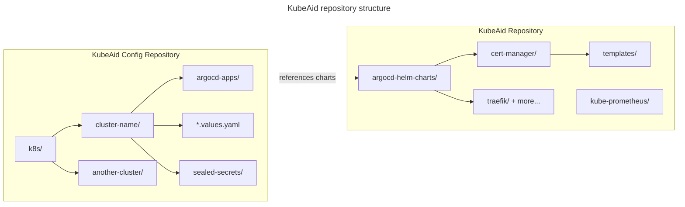

# Prerequisites

This guide helps you prepare everything needed to deploy a KubeAid-managed Kubernetes cluster.
Whether you're setting up a production environment in the cloud or a local development cluster, start here.

---

## Choose Your Deployment

KubeAid supports two deployment paths. Choose based on your use case:

| Deployment Type | Best For | What You Need |
| ----------------- | ---------- | --------------- |
| **Cloud / Distributed** | Production workloads, multi-node clusters | Cloud provider account (AWS, Azure, Hetzner) or bare metal servers |
| **Local (K3D)** | Development, testing, learning KubeAid | Docker running on your local machine |

> **New to KubeAid?** Start with a **Local K3D** deployment to explore the platform without incurring any cloud costs.

---

## System Requirements

### Minimum Compute Requirements

| Component | Local (K3D) | Cloud / Bare Metal (per node) |
| ----------- | ------------- | ------------------------------- |
| **RAM** | 8GB (16GB recommended) | 16GB+ |
| **CPU** | 4 cores | 4+ cores |
| **Storage** | 50GB free disk space | 100GB+ |

---

## Supported Architectures

KubeAid runs on the following CPU architectures:

| Architecture | Also Known As | Examples |
| -------------- | --------------- | ---------- |
| **amd64** | x86_64 | Intel Core, AMD Ryzen, most cloud VMs |
| **arm64** | aarch64 | Apple Silicon (M1/M2/M3/M4), Raspberry Pi 4+ |

---

## Supported Operating Systems

### For Your Local Machine (running KubeAid CLI)

- **Linux** - Ubuntu, Debian, Fedora, RHEL, etc.
- **macOS** - Intel and Apple Silicon
- **Windows** - Via WSL2 (Windows Subsystem for Linux)

### For Cluster Nodes

- **Linux only** - Ubuntu 22.04+ recommended

---

## Common Dependencies  
  
Before setting up any KubeAid cluster, ensure you have the following tools and resources ready:  

### Required Software  
  
The following packages must be installed on your local machine:  
  
- [`kubectl`](https://kubernetes.io/docs/tasks/tools/) - Kubernetes command-line tool (for operating the cluster)  
- [`jq`](https://jqlang.org/download/) - JSON processor  
- [`yq`](https://github.com/mikefarah/yq) - YAML processor  
- [`cilium-cli`](https://github.com/cilium/cilium-cli) - only required for `kubeaid-cli cluster test`  
- [`wireguard`](https://www.wireguard.com/install/) - VPN software (optional, for private cluster access)  

> **Note:** `kubeaid-cli` bundles the rest of its tooling (K3D, Helm, clusterctl, KubeOne) as Go libraries -
> you do **not** need to install Terraform, Terragrunt or similar infrastructure tools.
  
### Docker  
  
Ensure [Docker](https://docs.docker.com/get-docker/) is installed and running locally on your machine.
Docker Desktop is recommended for Linux, macOS, and Windows users for ease of use.
  
### Git Repositories  
  
You need to set up two Git repositories:  
  
1. **KubeAid Repository**: Fork or mirror the [KubeAid repository](https://github.com/Obmondo/KubeAid) from Obmondo.

  **Important**: Never make changes on the master/main branch of your mirror of the KubeAid repository,
  as this branch is used to deliver updates. All customizations should happen in your `kubeaid-config` repository.
  
1. **KubeAid Config Repository**: Fork the [KubeAid Config repository](https://github.com/Obmondo/kubeaid-config),
   which will contain your cluster-specific configurations.

#### Repository Structure Overview



> **Key Concept:** The KubeAid repo contains Helm charts and templates.
> Your KubeAid Config repo contains values files and ArgoCD Application manifests that reference those charts.
  
### Git Access (SSH-only)  
  
`kubeaid-cli` and ArgoCD access your Git repositories over **SSH only** - Personal Access Tokens (PATs) are not
used by `kubeaid-cli` itself. Keep ready:  
  
- an SSH keypair whose public key is registered with your Git provider (or added as a deploy key on your forks), or  
- a running `ssh-agent` with that key loaded (use the agent for passphrase-protected or hardware-backed keys).  
  
In `general.yaml` you point `kubeaid-cli` at this key via `git.privateKeyFilePath` **or** `git.useSSHAgent`
(exactly one of the two), and give ArgoCD its own deploy keys under `cluster.argoCD.deployKeys`.  
  
**Best Practice**: Create dedicated deploy keys per repository instead of reusing your personal SSH key.
  
## Provider-Specific Prerequisites  
  
### AWS  
  
- **AWS SSH KeyPair**: Create an AWS SSH KeyPair in the region where you'll be bootstrapping the cluster.
  
### Azure  
  
- **System Requirements**: A Linux or MacOS computer with at least 16GB of RAM
  (8GB might work but may encounter Out of memory (OOM) issues).
  
- **Service Principal**: [Register an application (Service Principal) in Microsoft Entra ID](https://learn.microsoft.com/en-us/entra/identity-platform/quickstart-register-app).
  
- **SSH Keypairs** (self-managed clusters only — AKS clusters need neither):
  - An **RSA** SSH keypair (public key provisioned onto the VMs for SSH
    access). Azure's ARM API rejects non-RSA keys at VM creation, so ed25519
    keys cannot be used here. Generate with:

    ```bash
    ssh-keygen -t rsa -b 4096 -f azure-ssh-key -C "azure-cluster-key"
    ```

  - An **RSA** keypair for the workload-identity OIDC provider (it signs the
    cluster's ServiceAccount tokens; Microsoft Entra ID verifies them with
    RS256, so ed25519 cannot be used here either). Generate with:

    ```bash
    ssh-keygen -t rsa -b 4096 -f ~/.ssh/azure-oidc-issuer -N ""
    ```

  > **Tip:** if your kubeaid-config deploy key happens to be RSA, kubeaid-cli
  > reuses its public half as the VM SSH key automatically and skips the
  > question.

- **AKS clusters** (`cloud.azure.aks: true`): register the kube-proxy
  configuration preview feature on the subscription before bootstrapping —
  KubeAid disables AKS's kube-proxy and runs Cilium with kube-proxy
  replacement:

  ```bash
  az feature register --namespace Microsoft.ContainerService --name KubeProxyConfigurationPreview
  az provider register --namespace Microsoft.ContainerService
  ```
  
### Bare Metal  
  
For general bare metal setups (non-Hetzner), only the common dependencies are required.
The bare metal provider uses [Kubermatic KubeOne](https://github.com/kubermatic/kubeone) under the hood for SSH-only access
platforms without API host management support.
  
### Hetzner  
  
#### Hetzner HCloud  
  
- **HCloud SSH KeyPair**: Create an HCloud SSH KeyPair.
  Note that no two HCloud SSH KeyPairs can have the same SSH public key.
  
#### Hetzner Bare Metal  
  
- **Hetzner Bare Metal SSH KeyPair**: Create a Hetzner Bare Metal SSH KeyPair at
  https://robot.hetzner.com/key/index. Note that no two Hetzner Bare Metal SSH KeyPairs can have the same SSH public key.
  
- **RAID Cleanup** (if applicable): If you plan to set `cloud.hetzner.bareMetal.wipeDisks: True` in your configuration,
  remove any pre-existing RAID setup from your Hetzner Bare Metal servers by executing
  `wipefs -fa <partition-name>` for each partition.
  
#### Hetzner Hybrid  
  
Requires both HCloud and Hetzner Bare Metal prerequisites listed above.
  
### Local K3D  
  
For local testing with K3D, only the common dependencies are required.
Note that this setup does not support cluster upgrades and disaster recovery.
  
## Notes  
  
- The cluster setup follows GitOps principles using ArgoCD, ensuring all changes are version-controlled through Git.
- KubeAid clusters are designed to be private by default, with optional Wireguard gateway for secure access.
- All providers use Cilium CNI running in kube-proxyless mode for networking.
