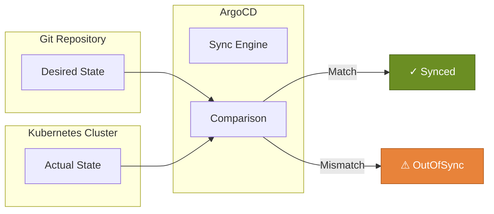

# GitOps Drift Detection with ArgoCD

KubeAid uses ArgoCD to implement GitOps principles, ensuring that your cluster state always matches what's defined in Git. This document explains how drift detection works and how to configure alerting.

## How Drift Detection Works

ArgoCD continuously monitors your cluster and compares it against the desired state in Git:



### Sync Status States

| Status | Meaning |
|--------|---------|
| **Synced** | Cluster matches Git - desired state achieved |
| **OutOfSync** | Cluster differs from Git - manual changes detected or pending updates |
| **Unknown** | ArgoCD cannot determine the state |

### Health Status States

| Status | Meaning |
|--------|---------|
| **Healthy** | All resources are running correctly |
| **Progressing** | Resources are being deployed/updated |
| **Degraded** | Some resources have issues |
| **Suspended** | Resources are paused |
| **Missing** | Resources don't exist yet |

## Types of Drift

### 1. Configuration Drift

When someone manually modifies a resource:

```bash
# This creates drift!
kubectl edit deployment my-app -n production
```

ArgoCD detects this and marks the application as `OutOfSync`.

### 2. Unmanaged Resources

Resources that exist in the cluster but are not tracked by ArgoCD. These can be:

- Manually created resources
- Resources from other deployment tools
- Leftover resources from deleted applications

## Detecting Unmanaged Resources

ArgoCD can track resources it doesn't manage (orphaned resources). This is configured per Application:

```yaml
apiVersion: argoproj.io/v1alpha1
kind: Application
metadata:
  name: my-app
spec:
  # ... other config ...
  syncPolicy:
    syncOptions:
      - CreateNamespace=true
  # Enable resource tracking
  source:
    plugin:
      env:
        - name: ARGOCD_APP_SOURCE_REPO
          value: "true"
```

### Viewing Unmanaged Resources

In the ArgoCD UI:
1. Navigate to your Application
2. Click on "App Details"
3. Look for resources marked with a warning icon

Via CLI:

```bash
argocd app resources <app-name> --orphaned
```

## Setting Up Alerting

### Prometheus Alerts for ArgoCD

ArgoCD exposes metrics that Prometheus can scrape. Add these alert rules:

```yaml
apiVersion: monitoring.coreos.com/v1
kind: PrometheusRule
metadata:
  name: argocd-alerts
  namespace: monitoring
spec:
  groups:
    - name: argocd
      rules:
        # Alert when application is out of sync
        - alert: ArgoCDApplicationOutOfSync
          expr: |
            argocd_app_info{sync_status="OutOfSync"} == 1
          for: 15m
          labels:
            severity: warning
          annotations:
            summary: "ArgoCD Application {{ $labels.name }} is out of sync"
            description: "Application {{ $labels.name }} has been OutOfSync for more than 15 minutes"
        
        # Alert when application is unhealthy
        - alert: ArgoCDApplicationUnhealthy
          expr: |
            argocd_app_info{health_status!~"Healthy|Progressing"} == 1
          for: 15m
          labels:
            severity: critical
          annotations:
            summary: "ArgoCD Application {{ $labels.name }} is unhealthy"
            description: "Application {{ $labels.name }} health status is {{ $labels.health_status }}"
        
        # Alert on sync failures
        - alert: ArgoCDSyncFailed
          expr: |
            argocd_app_sync_total{phase="Failed"} > 0
          for: 1m
          labels:
            severity: critical
          annotations:
            summary: "ArgoCD sync failed for {{ $labels.name }}"
            description: "Application {{ $labels.name }} sync operation failed"
```

### ArgoCD Notifications

ArgoCD has a built-in notification system. Configure it for Slack, email, or other channels:

```yaml
apiVersion: v1
kind: ConfigMap
metadata:
  name: argocd-notifications-cm
  namespace: argocd
data:
  trigger.on-sync-status-unknown: |
    - when: app.status.sync.status == 'Unknown'
      send: [app-sync-status]
  
  trigger.on-health-degraded: |
    - when: app.status.health.status == 'Degraded'
      send: [app-health-degraded]
  
  template.app-sync-status: |
    message: |
      Application {{.app.metadata.name}} sync status is {{.app.status.sync.status}}
  
  template.app-health-degraded: |
    message: |
      Application {{.app.metadata.name}} health has degraded
  
  service.slack: |
    token: $slack-token
```

## Auto-Healing (Self-Heal)

ArgoCD can automatically revert manual changes:

```yaml
apiVersion: argoproj.io/v1alpha1
kind: Application
metadata:
  name: my-app
spec:
  syncPolicy:
    automated:
      prune: true      # Remove resources not in Git
      selfHeal: true   # Revert manual changes
```

> **Warning:** Enable `selfHeal` carefully. It will override any manual changes!

## Best Practices

### 1. Never Make Manual Changes

All changes should go through Git:

```bash
# ❌ Don't do this
kubectl edit deployment my-app

# ✅ Do this instead
# 1. Edit the YAML in your Git repository
# 2. Create a Pull Request
# 3. Merge and let ArgoCD sync
```

### 2. Use Sync Windows

Prevent syncs during critical periods:

```yaml
apiVersion: argoproj.io/v1alpha1
kind: AppProject
metadata:
  name: production
spec:
  syncWindows:
    - kind: deny
      schedule: '0 22 * * *'  # No syncs at 10 PM
      duration: 8h
      applications:
        - '*'
```

### 3. Review Diffs Before Syncing

Always inspect what will change:

```bash
argocd app diff <app-name>
```

Or use the ArgoCD UI to see a visual diff.

### 4. Set Up Notifications

Configure alerts for:
- OutOfSync states lasting more than 15 minutes
- Health degradation
- Sync failures

## Troubleshooting

### Application Stuck OutOfSync

1. Check the diff:
   ```bash
   argocd app diff <app-name>
   ```

2. Common causes:
   - Immutable fields (e.g., `selector` in Deployments)
   - Defaulted fields that differ from manifest
   - Resources modified by controllers

3. Solutions:
   - Use `ignoreDifferences` for known discrepancies
   - Update your Git manifests to match the expected state

### Sync Fails Repeatedly

Check sync history:

```bash
argocd app history <app-name>
```

View detailed sync operation:

```bash
argocd app get <app-name> --show-operation
```

## See Also

- [ArgoCD Sync Options Documentation](https://argo-cd.readthedocs.io/en/stable/user-guide/sync-options/)
- [ArgoCD Notifications](https://argo-cd.readthedocs.io/en/stable/operator-manual/notifications/)
- [Resource Tracking](https://argo-cd.readthedocs.io/en/stable/user-guide/resource_tracking/)
