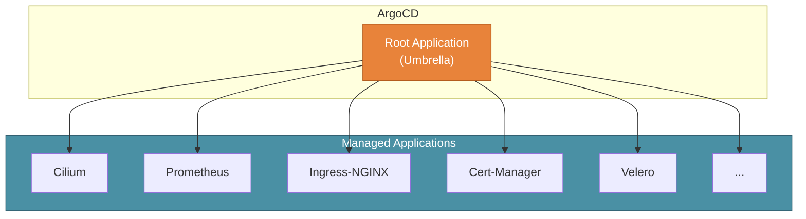

# Helm Umbrella Pattern in KubeAid

KubeAid uses the **Helm Umbrella Pattern** to manage applications in your Kubernetes clusters. This document explains how this pattern works and why it's beneficial.

## What is the Helm Umbrella Pattern?

The Helm Umbrella Pattern is an architectural approach where a single "parent" or "root" Helm chart (the "umbrella") manages multiple "child" charts as dependencies. In KubeAid's context:

- **Root Application**: The main ArgoCD Application that manages all other applications in the cluster
- **Child Applications**: Individual applications (Prometheus, Cilium, Ingress, etc.) that are managed by the root



## How KubeAid Implements This

### Directory Structure

In KubeAid, the `argocd-helm-charts/` directory contains **wrapper charts** for upstream applications. Each directory is a self-contained Helm chart that wraps an upstream chart as a dependency.

```
argocd-helm-charts/
├── cert-manager/            # Wrapper for cert-manager
│   ├── Chart.yaml           # Declares dependency on upstream chart
│   └── values.yaml          # KubeAid-specific default values
├── cilium/                  # Wrapper for cilium
│   ├── Chart.yaml
│   └── values.yaml
├── argo-cd/                 # Wrapper for argo-cd
│   ├── Chart.yaml
│   └── values.yaml
└── ...                      # 100+ additional wrapper charts
```

### The Root Application

The "Root" application (the Umbrella) is defined in your **`kubeaid-config` repository**. It is typically an "App of Apps" pattern that:

1.  Is generated/configured when you set up your cluster
2.  Contains manifest files (ApplicationSets or Applications) that point to the wrapper charts in KubeAid
3.  Manages the lifecycle of the entire cluster's software stack

When ArgoCD syncs this Root Application:
1.  It sees the list of child applications (e.g., Cilium, Cert-Manager)
2.  It creates ArgoCD Applications for each one
3.  Those Applications then point to the implementation in `argocd-helm-charts/`
4.  The wrapper charts in `argocd-helm-charts/` then pull in the actual upstream Helm charts

## Benefits of This Pattern

### 1. Single Point of Control

All applications are managed from one place. To see what's deployed:

```bash
kubectl get applications -n argocd
```

### 2. Consistent Configuration

Values can be propagated from the root to child applications, ensuring consistency:

```yaml
# In root values.yaml
global:
  clusterName: production
  domain: example.com
```

### 3. Dependency Management

ArgoCD handles dependency ordering through sync waves:

```yaml
metadata:
  annotations:
    argocd.argoproj.io/sync-wave: "1"  # Cilium first
---
metadata:
  annotations:
    argocd.argoproj.io/sync-wave: "2"  # Then cert-manager
```

### 4. GitOps Compliance

Every change flows through Git:
1. Make changes in your `kubeaid-config` repository
2. Create a Pull Request
3. Review and merge
4. ArgoCD automatically syncs

### 5. Easy Updates

KubeAid updates the upstream charts in `argocd-helm-charts/`. To update your cluster:

```bash
# In your kubeaid fork
git pull upstream main

# ArgoCD detects changes and shows them as "OutOfSync"
# Review and sync when ready
```

## Working with the Pattern

### Adding a New Application

1. Check if the chart exists in `argocd-helm-charts/`
2. Enable it in your cluster's values:

```yaml
# kubeaid-config/k8s/<cluster>/values.yaml
applications:
  velero:
    enabled: true
    values:
      # Your custom values here
```

3. Commit and push - ArgoCD will deploy it

### Customizing an Application

Override values in your `kubeaid-config` repository:

```yaml
# kubeaid-config/k8s/<cluster>/argocd/cert-manager.yaml
spec:
  source:
    helm:
      values: |
        installCRDs: true
        global:
          leaderElection:
            namespace: cert-manager
```

### Disabling an Application

Remove or disable it in your configuration:

```yaml
applications:
  some-app:
    enabled: false
```

## Relationship with ArgoCD

ArgoCD's Application CR (Custom Resource) is the key abstraction:

```yaml
apiVersion: argoproj.io/v1alpha1
kind: Application
metadata:
  name: cert-manager
  namespace: argocd
spec:
  project: default
  source:
    repoURL: https://github.com/YourOrg/kubeaid.git
    path: argocd-helm-charts/cert-manager
    targetRevision: main
  destination:
    server: https://kubernetes.default.svc
    namespace: cert-manager
  syncPolicy:
    automated:
      prune: true
      selfHeal: true
```

## See Also

- [ArgoCD Application CRD Documentation](https://argo-cd.readthedocs.io/en/stable/operator-manual/declarative-setup/)
- [Helm Dependencies](https://helm.sh/docs/helm/helm_dependency/)
- [Available Charts in KubeAid](../../argocd-helm-charts/)
