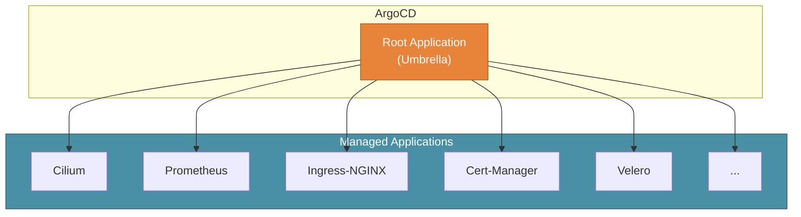

# Helm Umbrella Pattern in KubeAid

KubeAid uses the **Helm Umbrella Pattern** to manage applications in your Kubernetes clusters. This document explains
how this pattern works and why it's beneficial.

## What is the Helm Umbrella Pattern?

The Helm Umbrella Pattern is an architectural approach where a single "parent" or "root" Helm chart (the "umbrella")
manages multiple "child" charts as dependencies. In KubeAid's context:

- **Root Application**: The main ArgoCD Application that manages all other applications in the cluster
- **Child Applications**: Individual applications (Prometheus, Cilium, Ingress, etc.) that are managed by the root


```mermaid
flowchart TB
    subgraph ArgoCD["ArgoCD"]
        Root["Root Application<br/>(Umbrella)"]
    end
    
    subgraph Apps["Managed Applications"]
        direction LR
        Cilium["Cilium"]
        Prometheus["Prometheus"]
        Ingress["Ingress-NGINX"]
        CertManager["Cert-Manager"]
        Velero["Velero"]
        More["..."]
    end
    
    Root --> Cilium
    Root --> Prometheus
    Root --> Ingress
    Root --> CertManager
    Root --> Velero
    Root --> More
    
    style Root fill:#e8833a,stroke:#b35c1e,color:#fff
    style Apps fill:#4a90a4,stroke:#2d5a6b,color:#fff
```

## How KubeAid Implements This

### Directory Structure

In KubeAid, the `argocd-helm-charts/` directory contains **wrapper charts** for upstream applications. Each directory is
a self-contained Helm chart that wraps an upstream chart as a dependency.

```text
argocd-helm-charts/
├── cert-manager/            # Wrapper for cert-manager
│   ├── Chart.yaml           # Declares dependency on upstream chart
│   └── values.yaml          # KubeAid-specific default values
├── cilium/                  # Wrapper for cilium
│   ├── Chart.yaml
│   └── values.yaml
├── argo-cd/                 # Wrapper for argo-cd
│   ├── Chart.yaml
│   └── values.yaml
└── ...                      # 100+ additional wrapper charts
```

### The Root Application

The "Root" application (the Umbrella) is defined in your **`kubeaid-config` repository**. It is typically an "App of
Apps" pattern that:

1. Is generated/configured when you set up your cluster
2. Contains manifest files (ApplicationSets or Applications) that point to the wrapper charts in KubeAid
3. Manages the lifecycle of the entire cluster's software stack

When ArgoCD syncs this Root Application:

1. It sees the list of child applications (e.g., Cilium, Cert-Manager)
2. It creates ArgoCD Applications for each one
3. Those Applications then point to the implementation in `argocd-helm-charts/`
4. The wrapper charts in `argocd-helm-charts/` then pull in the actual upstream Helm charts

## Benefits of This Pattern

### 1. Single Point of Control

All applications are managed from one place. To see what's deployed:

```bash
kubectl get applications -n argocd
```

### 2. Consistent Configuration

Values can be propagated from the root to child applications, ensuring consistency:

```yaml
# In root values.yaml
global:
  clusterName: production
  domain: example.com
```

### 3. Dependency Management

ArgoCD handles dependency ordering through sync waves:

```yaml
metadata:
  annotations:
    argocd.argoproj.io/sync-wave: "1"  # Cilium first
---
metadata:
  annotations:
    argocd.argoproj.io/sync-wave: "2"  # Then cert-manager
```

### 4. GitOps Compliance

Every change flows through Git:

1. Make changes in your `kubeaid-config` repository
2. Create a Pull Request
3. Review and merge
4. ArgoCD automatically syncs

### 5. Easy Updates

KubeAid updates the upstream charts in `argocd-helm-charts/`. To update your cluster:

```bash
# In your kubeaid fork
git pull upstream main

# ArgoCD detects changes and shows them as "OutOfSync"
# Review and sync when ready
```

## Working with the Pattern

Each cluster's applications live in your kubeaid-config repository under `k8s/<cluster>/argocd-apps/`: an
`Application` manifest per app in `templates/`, and a `values-<app>.yaml` per app next to them.

### Adding a New Application

1. Check that the chart exists in `argocd-helm-charts/`.
2. Add an `Application` manifest at `k8s/<cluster>/argocd-apps/templates/<app>.yaml`, following the two-source
   pattern — the chart comes from KubeAid, the values from your kubeaid-config repo:

```yaml
# k8s/<cluster>/argocd-apps/templates/velero.yaml
apiVersion: argoproj.io/v1alpha1
kind: Application
metadata:
  name: velero
  namespace: argocd
spec:
  destination:
    namespace: velero
    server: https://kubernetes.default.svc
  project: default
  sources:
    - repoURL: https://github.com/Obmondo/kubeaid.git
      path: argocd-helm-charts/velero
      targetRevision: <kubeaid-release-tag>
      helm:
        valueFiles:
          - $values/k8s/<cluster>/argocd-apps/values-velero.yaml
    - repoURL: <your-kubeaid-config-repo-url>
      targetRevision: HEAD
      ref: values
```

1. Add `k8s/<cluster>/argocd-apps/values-velero.yaml` with your overrides, commit and push — ArgoCD deploys it.

### Customizing an Application

Edit the app's values file. Keys under the subchart's name override the vendored upstream chart; top-level keys
configure the wrapper's own KubeAid additions:

```yaml
# k8s/<cluster>/argocd-apps/values-cert-manager.yaml
cert-manager:        # -> the vendored upstream chart
  installCRDs: true
issuer:              # -> the KubeAid wrapper's own template
  name: letsencrypt
  enabled: true
```

### Disabling an Application

Delete the app's `Application` manifest from `k8s/<cluster>/argocd-apps/templates/` (and its values file), then
sync the root app with prune — ArgoCD removes the application and its resources.

## Relationship with ArgoCD

ArgoCD's Application CR (Custom Resource) is the key abstraction:

```yaml
apiVersion: argoproj.io/v1alpha1
kind: Application
metadata:
  name: cert-manager
  namespace: argocd
spec:
  project: default
  source:
    repoURL: https://github.com/YourOrg/kubeaid.git
    path: argocd-helm-charts/cert-manager
    targetRevision: main
  destination:
    server: https://kubernetes.default.svc
    namespace: cert-manager
  syncPolicy:
    automated:
      prune: true
      selfHeal: true
```

## See Also

- [ArgoCD Application CRD Documentation](https://argo-cd.readthedocs.io/en/stable/operator-manual/declarative-setup/)
- [Helm Dependencies](https://helm.sh/docs/helm/helm_dependency/)
- [Available Charts in KubeAid](../../argocd-helm-charts/)
