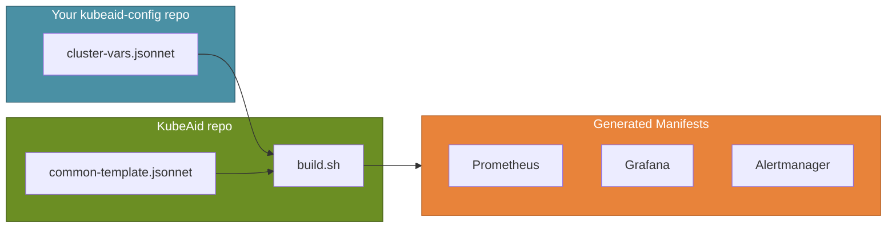

# Prometheus Configuration in KubeAid

KubeAid uses [kube-prometheus](https://github.com/prometheus-operator/kube-prometheus) to provide a comprehensive monitoring stack including Prometheus, Grafana, and Alertmanager. This guide explains how to configure monitoring for your cluster.

## Overview

The monitoring stack is configured using Jsonnet files that generate Kubernetes manifests. This approach provides:

- **Customizable configuration** per cluster
- **CI/CD integration** for automated updates
- **Reusable mixins** for common monitoring patterns



## Configuration Files

### Cluster Variables File

Each cluster has a Jsonnet variables file at:

```
kubeaid-config/k8s/<cluster-name>/<cluster-name>-vars.jsonnet
```

Example configuration:

```jsonnet
{
  // Cluster identification
  cluster_name: 'production',
  cluster_domain: 'example.com',
  
  // kube-prometheus version to use
  kube_prometheus_version: 'v0.14.0',
  
  // Prometheus configuration
  prometheus_replicas: 2,
  prometheus_retention: '30d',
  prometheus_storage_size: '100Gi',
  
  // Alertmanager configuration
  alertmanager_replicas: 3,
  
  // Grafana configuration
  grafana_domain: 'grafana.example.com',
  
  // Namespaces to scrape metrics from
  prometheus_scrape_namespaces: [
    'default',
    'kube-system',
    'monitoring',
    'rook-ceph',
    'logging',
  ],
  
  // Enable custom metrics API (for HPA)
  enable_custom_metrics_apiservice: true,
  
  // Enable mixins
  addMixins: {
    ceph: true,
    sealedsecrets: true,
    etcd: true,
    velero: true,
    'cert-manager': true,
  },
}
```

## Building Prometheus Manifests

### Prerequisites

Install the required tools:

```bash
# On macOS
brew install bash jsonnet

# On Linux (using Go)
go install github.com/jsonnet-bundler/jsonnet-bundler/cmd/jb@latest
go install github.com/brancz/gojsontoyaml@latest
go install github.com/google/go-jsonnet/cmd/jsonnet@latest
```

### Running the Build

From the KubeAid repository root:

```bash
./build/kube-prometheus/build.sh ../kubeaid-config/k8s/<cluster-name>
```

This generates manifests in:

```
kubeaid-config/k8s/<cluster-name>/kube-prometheus/
```

### Applying to Cluster

Commit the generated manifests and sync via ArgoCD, or apply manually:

```bash
kubectl apply -f ../kubeaid-config/k8s/<cluster-name>/kube-prometheus/
```

## Common Configuration Options

### Scraping Additional Namespaces

Add namespaces to the scrape list:

```jsonnet
prometheus_scrape_namespaces: [
  'default',
  'kube-system',
  'monitoring',
  'my-application',  // Add your namespace
],
```

### Custom Alerting Rules

Add Prometheus adapter rules for custom metrics:

```jsonnet
prometheus_adapter_additional_rules: [
  {
    seriesQuery: 'my_custom_metric',
    name: { as: 'custom_metric_rate' },
    resources: {
      overrides: {
        pod: { resource: 'pod' },
        namespace: { resource: 'namespace' },
      },
    },
    metricsQuery: 'rate(my_custom_metric{<<.LabelMatchers>>}[5m])',
  },
],
```

### Custom Grafana Dashboards

Add your own dashboards:

```jsonnet
grafana_dashboards: {
  'Custom Folder': {
    'my-dashboard.json': (import '../dashboards/my-dashboard.json'),
  },
},
```

See the [build/kube-prometheus README](../../build/kube-prometheus/README.md#adding-support-for-custom-dashboards-in-grafana) for detailed instructions.

### Alertmanager Configuration

Configure alerting channels by creating a sealed secret:

```bash
kubectl create secret generic alertmanager-main \
  --dry-run=client \
  --namespace monitoring \
  --from-literal=slack-url='https://your-slack-webhook-url' \
  -o yaml | \
  kubeseal --controller-namespace system \
           --controller-name sealed-secrets \
           --namespace monitoring \
           -o yaml > alertmanager-main.yaml
```

See [alertmanager configuration examples](../../build/kube-prometheus/examples/alertmanager-config/).

## CI/CD Integration

KubeAid supports automatic PR creation when monitoring configurations change.

### GitHub Actions

Set these repository secrets:

| Variable | Description |
|----------|-------------|
| `API_TOKEN_GITHUB` | GitHub PAT with `repo` permission |
| `OBMONDO_DEPLOY_REPO_TARGET` | Target repo (e.g., `org/kubeaid-config`) |
| `OBMONDO_DEPLOY_REPO_TARGET_BRANCH` | Branch name (e.g., `main`) |

### GitLab CI

Set these CI/CD variables:

| Variable | Description |
|----------|-------------|
| `KUBERNETES_CONFIG_REPO_TOKEN` | GitLab token with `api` and `read_repository` |
| `KUBERNETES_CONFIG_REPO_URL` | Full repo URL |

## Upgrading kube-prometheus

To upgrade to a new version:

1. Update `kube_prometheus_version` in your vars file:

```jsonnet
kube_prometheus_version: 'v0.14.0',  // Update this
```

2. Run the build script:

```bash
./build/kube-prometheus/build.sh ../kubeaid-config/k8s/<cluster-name>
```

3. Review generated changes and commit

4. Sync via ArgoCD

## Troubleshooting

### Build Errors

If you encounter dependency errors, clean and rebuild:

```bash
rm -rf ./build/kube-prometheus/libraries/<version>/
./build/kube-prometheus/build.sh ../kubeaid-config/k8s/<cluster-name>
```

### Missing Metrics

Verify the namespace is in `prometheus_scrape_namespaces` and that ServiceMonitors exist:

```bash
kubectl get servicemonitors -A
```

### Grafana Password Reset

```bash
GrafanaPod=$(kubectl get pods -n monitoring | grep grafana | awk '{print $1}')
kubectl exec -it $GrafanaPod -n monitoring -- grafana-cli admin reset-admin-password <new-password>
```

## See Also

- [kube-prometheus Build Documentation](../../build/kube-prometheus/README.md)
- [Pod Autoscaling Guide](../operations/monitoring/pod-autoscaling.md)
- [Prometheus Namespace Configuration](../operations/monitoring/prometheus-namespaces.md)
- [Upstream kube-prometheus](https://github.com/prometheus-operator/kube-prometheus)
