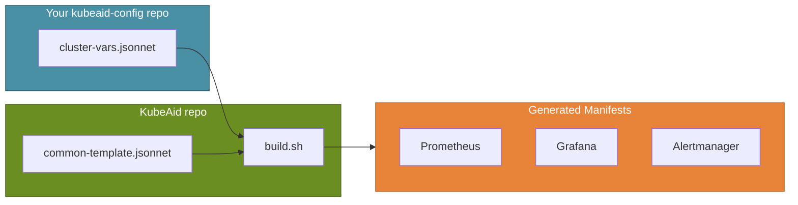

# Prometheus Configuration in KubeAid

KubeAid uses [kube-prometheus](https://github.com/prometheus-operator/kube-prometheus) to provide a comprehensive
monitoring stack including Prometheus, Grafana, and Alertmanager. This guide explains how to configure monitoring for
your cluster.

## Overview

The monitoring stack is configured using Jsonnet files that generate Kubernetes manifests. This approach provides:

- **Customizable configuration** per cluster
- **CI/CD integration** for automated updates
- **Reusable mixins** for common monitoring patterns


```mermaid
flowchart LR
    subgraph Config["Your kubeaid-config repo"]
        Vars["cluster-vars.jsonnet"]
    end
    
    subgraph KubeAid["KubeAid repo"]
        Build["build.sh"]
        Template["common-template.jsonnet"]
    end
    
    subgraph Output["Generated Manifests"]
        Prometheus["Prometheus"]
        Grafana["Grafana"]
        Alertmanager["Alertmanager"]
    end
    
    Vars --> Build
    Template --> Build
    Build --> Output
    
    style Config fill:#4a90a4,stroke:#2d5a6b,color:#fff
    style KubeAid fill:#6b8e23,stroke:#4a6319,color:#fff
    style Output fill:#e8833a,stroke:#b35c1e,color:#fff
```

## Configuration Files

### Cluster Variables File

Each cluster has a Jsonnet variables file at:

```text
kubeaid-config/k8s/<cluster-name>/<cluster-name>-vars.jsonnet
```

Example configuration:

```jsonnet
{
  // Which platform Kubernetes runs on, e.g. 'kubeadm', 'kops' or 'aks'
  platform: 'kubeadm',

  // Connect to Obmondo monitoring; certname format is '<cluster>.<customerid>'
  connect_obmondo: true,
  certname: 'production.customer1',
  
  // kube-prometheus version to use
  kube_prometheus_version: 'v0.18.0',
  
  // Prometheus configuration
  prometheus+: {
    retention: '30d',
    storage: {
      size: '100Gi',
      classname: 'rook-ceph-block',
    },
  },
  
  // Grafana configuration
  grafana_root_url: 'https://grafana.example.com',
  grafana_ingress_host: 'grafana.example.com',
  
  // Namespaces to scrape metrics from
  prometheus_scrape_namespaces: [
    'default',
    'kube-system',
    'monitoring',
    'rook-ceph',
    'logging',
  ],
  
  // Enable custom metrics API (for HPA)
  enable_custom_metrics_apiservice: true,
  
  // Enable mixins
  addMixins+: {
    ceph: true,
    sealedsecrets: true,
    etcd: true,
    velero: true,
    'cert-manager': true,
    'orphan-pvc': true,
  },
}
```

## Building Prometheus Manifests

### Prerequisites

Install the required tools:

```bash
# On macOS
brew install bash jsonnet

# On Linux (using Go)
go install github.com/jsonnet-bundler/jsonnet-bundler/cmd/jb@latest
go install github.com/brancz/gojsontoyaml@latest
go install github.com/google/go-jsonnet/cmd/jsonnet@latest
```

### Running the Build

From the KubeAid repository root:

```bash
./build/kube-prometheus/build.sh ../kubeaid-config/k8s/<cluster-name>
```

This generates manifests in:

```text
kubeaid-config/k8s/<cluster-name>/kube-prometheus/
```

### Applying to Cluster

Commit the generated manifests to your `kubeaid-config` repository and let ArgoCD sync them - every change goes
through Git.

## Common Configuration Options

### Scraping Additional Namespaces

Add namespaces to the scrape list:

```jsonnet
prometheus_scrape_namespaces: [
  'default',
  'kube-system',
  'monitoring',
  'my-application',  // Add your namespace
],
```

After committing the change and running the build (see [Building Prometheus Manifests](#building-prometheus-manifests)
above) and syncing via ArgoCD, verify the namespace is actually being scraped:

- Access the Prometheus UI (via port-forward or ingress).
- Navigate to the **Status** menu.
- Confirm the targets list includes the services and pods from the namespace you added.

### Custom Alerting Rules

Add Prometheus adapter rules for custom metrics:

```jsonnet
prometheus_adapter_additional_rules: [
  {
    seriesQuery: 'my_custom_metric',
    name: { as: 'custom_metric_rate' },
    resources: {
      overrides: {
        pod: { resource: 'pod' },
        namespace: { resource: 'namespace' },
      },
    },
    metricsQuery: 'rate(my_custom_metric{<<.LabelMatchers>>}[5m])',
  },
],
```

### Custom Grafana Dashboards

Add your own dashboards:

```jsonnet
grafana_dashboards: {
  'Custom Folder': {
    'my-dashboard.json': (import '../dashboards/my-dashboard.json'),
  },
},
```

See the [build/kube-prometheus Grafana
docs](../../build/kube-prometheus/docs/grafana.md#adding-custom-dashboards-via-gitops) for detailed
instructions.

### Alertmanager Configuration

Configure alerting channels by creating a sealed secret:

```bash
kubectl create secret generic alertmanager-main \
  --dry-run=client \
  --namespace monitoring \
  --from-literal=slack-url='https://your-slack-webhook-url' \
  -o yaml | \
  kubeseal --controller-namespace system \
           --controller-name sealed-secrets \
           --namespace monitoring \
           -o yaml > alertmanager-main.yaml
```

See [alertmanager configuration examples](../../build/kube-prometheus/examples/alertmanager-config/).

## Pod Autoscaling with Custom Metrics

**NOTE: Do not combine Kubernetes HPA + Prometheus Adapter (described below) with the Keda project's autoscaling for
the same deployment. They will compete with each other and break things.**

### Introduction & Situation

- Your application (running on K8s via a `Deployment` of pods) exposes metrics on an http endpoint.
- There is a `Service` for that deployment.
- There is a `ServiceMonitor` (K8s resource) for that service that tells Prometheus that it needs to scrape metrics
  from that service. Most likely it will add `pod="pod-name"` and `namespace="namespace-name"` labels to the metrics
  it fetches from individual pods.

### Setup Prerequisites

_This needs to be done only once._

- Set `enable_custom_metrics_apiservice: true` in your cluster's Jsonnet vars file (see
  [Configuration Files](#configuration-files) above).
- Ensure `kube_prometheus_version` is at least `v0.13.0` (the oldest supported release; current examples use
  `v0.18.0` - run `build.sh --versions` for the full Kubernetes compatibility table).

Regenerate the kube-prometheus YAML (see [Building Prometheus Manifests](#building-prometheus-manifests) above). This
will generate a few YAML files which define (setup or re-configure) prometheus, grafana, alertmanager,
prometheus-adapter, and other resources and configs needed by them.

We use the Prometheus Adapter to provide the `custom.metrics.k8s.io` API.

Commit the changes to your cluster config repo and sync.

You should now see `custom.metrics.k8s.io` as running in the output of `kubectl api-versions`.

### Autoscaling HPA based on CPU/Memory and Custom Metrics

HorizontalPodAutoscaler automatically updates the replica count of a Deployment, with the aim of automatically scaling
the workload to match demand.

You can follow two methods here, depending on what you want to do. Method B is longer and is a superset of Method A.

- Method A: if your custom metric has the `pod="pod-name"` and `namespace="namespace-name"` label when you check it
  inside Prometheus.
- Method B: if you want to scale based on some result derived by performing a PromQL query on multiple custom
  metrics or if you have other advanced usecases.

In addition to scaling based on custom metrics you can scale based on CPU/Memory too in both methods.

#### Method A

You do not need to set Prometheus Adapter rules yourself, as the default rules in KubeAid already expose your custom
metrics to K8s as long as they have the `pod="pod-name"` and `namespace="namespace-name"` labels.

You can list all metrics available to K8s with `kubectl get --raw /apis/custom.metrics.k8s.io/v1beta1 | jq`.

Lets say you have a metric
`autoscaleexp_custom_metric{pod="...", namespace="..."}` in the `autoscaleexp` namespace.

Check if it's working correctly with
`kubectl get --raw /apis/custom.metrics.k8s.io/v1beta1/namespaces/autoscaleexp/pods/*/autoscaleexp_custom_metric | jq`.
You will see one item for each replica and each item will have the current value of the metric for that pod.

If it works, configure your HPA:

```yaml
apiVersion: autoscaling/v2
kind: HorizontalPodAutoscaler
metadata:
  name: intensive-app
spec:
  maxReplicas: 5
  minReplicas: 2
  scaleTargetRef:
    apiVersion: apps/v1
    kind: Deployment
    name: intensive-app
  behavior:
    scaleDown:
      stabilizationWindowSeconds: 50
    scaleUp:
      policies:
        - type: Percent
          value: 50
          periodSeconds: 15
      selectPolicy: Max
      stabilizationWindowSeconds: 0
  metrics:
    - type: Resource
      resource:
        name: cpu
        target:
          averageUtilization: 30
          type: Utilization
    - type: Pods
      pods:
        metric:
          name: autoscaleexp_custom_metric
        target:
          type: AverageValue
          averageValue: 80
```

#### Method B

If you want to scale based on some result derived by performing a PromQL query on multiple custom metrics or
for any other advanced scenario, you need to add a Prometheus Adapter rule (see
[Custom Alerting Rules](#custom-alerting-rules) above for the general shape of these rules).

Lets say you want a new metric called `busy_optimizers_pct` which is the result of combining two metrics
called `optimization_requests_inprogress` and `optimization_tests_inprogress` which are exposed by pods in
the `modeling` namespace.

First check if `optimization_requests_inprogress` and `optimization_tests_inprogress` are accessible.

Example for `optimization_requests_inprogress`:

```shell
kubectl get --raw /apis/custom.metrics.k8s.io/v1beta1/namespaces/modeling/pods/*/optimization_requests_inprogress | jq
```

You will see one item for each replica and each item will have the current value of
`optimization_requests_inprogress` for that pod.

Write the rule in jsonnet, generate YAML and sync.

```jsonnet
  prometheus_adapter_additional_rules: [
    {
      seriesQuery: 'optimization_tests_inprogress',
      name: {
        as: 'busy_optimizers_pct',
      },
      resources: {
        overrides: {
          pod: {
            resource: 'pod',
          },
          namespace: {
            resource: 'namespace',
          },
        },
      },
      metricsQuery: '(sum(optimization_tests_inprogress{<<.LabelMatchers>>}) by (pod, namespace) + sum(optimization_requests_inprogress{<<.LabelMatchers>>}) by (pod, namespace)) * 100',
    },
  ],
```

Some notes for writing prometheus adapter rules:

- [Docs](https://github.com/kubernetes-sigs/prometheus-adapter/blob/master/docs/config.md)
- We have to define resource overrides to associate a metric with a K8s resource.
  Left side is the label name (that label should be present in the original metrics) and right side is
  the kind of the k8s resource that label represents.
- `name > as` is the new name of a metric in the custom metrics API and it's value is the result of `metricsQuery`.

Wait for a minute and then check if the new metric `busy_optimizers_pct` is available via the API.

```shell
kubectl get --raw /apis/custom.metrics.k8s.io/v1beta1/namespaces/modeling/pods/*/busy_optimizers_pct | jq
```

Like before, you will see one item for each replica and each item will have the current value
of `busy_optimizers_pct` for that pod.

Configure the HPA.

```yaml
apiVersion: autoscaling/v2
kind: HorizontalPodAutoscaler
metadata:
  name: optimizer-v5
spec:
  maxReplicas: 5
  minReplicas: 2
  scaleTargetRef:
    apiVersion: apps/v1
    kind: Deployment
    name: optimizer-v5
  behavior:
    scaleDown:
      stabilizationWindowSeconds: 50
    scaleUp:
      policies:
        - type: Percent
          value: 50
          periodSeconds: 15
      selectPolicy: Max
      stabilizationWindowSeconds: 0
  metrics:
    - type: Resource
      resource:
        name: cpu
        target:
          averageUtilization: 50
          type: Utilization
    - type: Pods
      pods:
        metric:
          name: busy_optimizers_pct
        target:
          type: AverageValue
          averageValue: 90
```

### Algorithm Behavior

- If you're using Pod metrics (used in the examples in this guide) and not Object metrics then each pod in the
  deployment will probably have a different value of the custom metric. The controller will take the mean of the
  raw value of that metric across all pods and compare that against the target value set by you to determine the
  desired replica count.
- If you have multiple items in `HPA's Spec > metrics` for example one item for CPU, one for memory and another
  for a custom metric and each returns a different desired replica count then the maximum of those will be chosen.
- You can configure Stabilization window and Scaling policies to change how much time to wait before scaling and
  how fast should it scale.

### Reference Links

- <https://kubernetes.io/docs/tasks/run-application/horizontal-pod-autoscale/>
- <https://kubernetes.io/docs/tasks/run-application/horizontal-pod-autoscale-walkthrough/>
- <https://github.com/kubernetes-sigs/prometheus-adapter/blob/master/docs/walkthrough.md>
- <https://github.com/kubernetes-sigs/prometheus-adapter/blob/master/docs/config.md>
- <https://github.com/kubernetes-sigs/prometheus-adapter/blob/master/docs/config-walkthrough.md>

## CI/CD Integration

KubeAid supports automatic PR creation when monitoring configurations change.

### GitHub Actions

Set these repository secrets:

| Variable | Description |
| ---------- | ------------- |
| `API_TOKEN_GITHUB` | GitHub PAT with `repo` permission |
| `OBMONDO_DEPLOY_REPO_TARGET` | Target repo (e.g., `org/kubeaid-config`) |
| `OBMONDO_DEPLOY_REPO_TARGET_BRANCH` | Branch name (e.g., `main`) |

### GitLab CI

Set these CI/CD variables:

| Variable | Description |
| ---------- | ------------- |
| `KUBERNETES_CONFIG_REPO_TOKEN` | GitLab token with `api` and `read_repository` |
| `KUBERNETES_CONFIG_REPO_URL` | Full repo URL |

## Upgrading kube-prometheus

To upgrade to a new version:

1. Update `kube_prometheus_version` in your vars file:

```jsonnet
kube_prometheus_version: 'v0.18.0',  // Update this
```

1. Run the build script:

```bash
./build/kube-prometheus/build.sh ../kubeaid-config/k8s/<cluster-name>
```

1. Review generated changes and commit

2. Sync via ArgoCD

## Troubleshooting

### Build Errors

If you encounter dependency errors, clean and rebuild:

```bash
rm -rf ./build/kube-prometheus/libraries/<version>/
./build/kube-prometheus/build.sh ../kubeaid-config/k8s/<cluster-name>
```

### Missing Metrics

Verify the namespace is in `prometheus_scrape_namespaces` and that ServiceMonitors exist:

```bash
kubectl get servicemonitors -A
```

### Grafana Password Reset

```bash
GrafanaPod=$(kubectl get pods -n monitoring | grep grafana | awk '{print $1}')
kubectl exec -it $GrafanaPod -n monitoring -- grafana-cli admin reset-admin-password <new-password>
```

## See Also

- [Monitoring](../monitoring.md)
- [kube-prometheus Build Documentation](../../build/kube-prometheus/README.md)
- [Upstream kube-prometheus](https://github.com/prometheus-operator/kube-prometheus)
