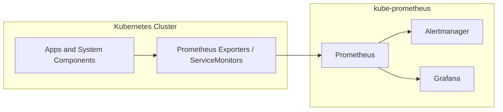
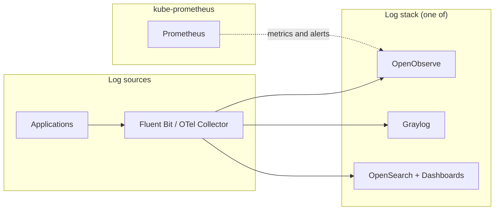

# Monitoring in KubeAid

KubeAid monitoring has two layers:

1. **Metrics** — `kube-prometheus` (Prometheus, Alertmanager, Grafana)
2. **Logs** — one of OpenObserve, Graylog, or OpenSearch + Kibana

Per-stack setup and operations are documented in each application's Helm chart README (linked below).

## Metrics: kube-prometheus

[kube-prometheus](https://github.com/prometheus-operator/kube-prometheus) is the default monitoring stack. It provides:

- **Prometheus** — scrapes metrics from ServiceMonitors, PodMonitors, and exporters across the cluster
- **Alertmanager** — routes metric-based alerts to notification channels
- **Grafana** — dashboards for metrics visualization

Configuration is managed per cluster via Jsonnet (`<cluster-name>-vars.jsonnet`) and built into Kubernetes manifests.
See [Prometheus Configuration](./kubeaid/prometheus-configuration.md) for details.

## Log monitoring

Log monitoring runs alongside `kube-prometheus`. Each option handles log ingestion, search, and log-based alerting on
its own — none of them replace Prometheus for metrics.

| Option | Scope | Log collection | Prometheus integration | Application docs |
| ------ | ----- | -------------- | ---------------------- | ---------------- |
| OpenObserve | Logs, metrics, and alerts | OpenTelemetry (`OTLP`) | Pulls metrics and alerts from Prometheus; alerts on logs | [openobserve](../argocd-helm-charts/openobserve/README.md) |
| Graylog | Logs only | Fluent Bit, Fluentd, Beats, Syslog, GELF, etc. | None (metrics stay in kube-prometheus) | [graylog](../argocd-helm-charts/graylog/README.md) |
| OpenSearch + Kibana | Logs only (ELK-style) | Fluent Bit, Fluentd, OpenTelemetry Collector, etc. | None (metrics stay in kube-prometheus) | [opensearch](../argocd-helm-charts/opensearch/README.md), [opensearch-dashboards](../argocd-helm-charts/opensearch-dashboards/charts/opensearch-dashboards/README.md) |

### OpenObserve

OpenObserve uses the **OpenTelemetry** standard for ingestion. It can ingest logs via OpenTelemetry Collector, pull
metrics and alerts from Prometheus, and provide log-based search and alerting.

- [OpenObserve Helm chart](../argocd-helm-charts/openobserve/README.md)
- [OpenObserve Collector reference](../argocd-helm-charts/openobserve/charts/openobserve-collector/docs/README.md)

### Graylog

Graylog focuses on **log collection and management**. Logs are shipped using agents such as Fluent Bit or other
supported inputs. Graylog does not integrate with Prometheus for metrics or alerting.

- [Graylog Helm chart](../argocd-helm-charts/graylog/README.md)

### OpenSearch and Kibana

OpenSearch with Kibana (or OpenSearch Dashboards) is an alternative to Graylog: centralized log storage, search, and
visualization without a Graylog management layer. KubeAid includes Helm charts for OpenSearch and OpenSearch
Dashboards; Kibana itself is not packaged.

- [OpenSearch Helm chart](../argocd-helm-charts/opensearch/README.md)
- [OpenSearch Dashboards Helm chart](../argocd-helm-charts/opensearch-dashboards/charts/opensearch-dashboards/README.md)

## Alerting strategy

- **Metric alerts** — Prometheus rules evaluated by Prometheus, routed by Alertmanager
- **Log alerts** — evaluated by the log stack (OpenObserve, Graylog, or OpenSearch)

Metrics tell you that something is unhealthy; logs help explain why.

## Further reading

- [Prometheus Configuration](./kubeaid/prometheus-configuration.md) — kube-prometheus setup and Jsonnet build
- [Prometheus Namespaces](./operations/monitoring/prometheus-namespaces.md) — namespace scrape scope
- [Pod Autoscaling](./operations/monitoring/pod-autoscaling.md) — HPA with custom metrics from Prometheus
