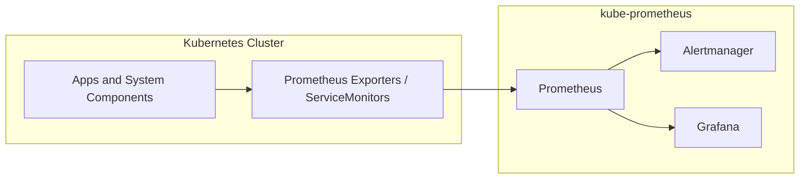
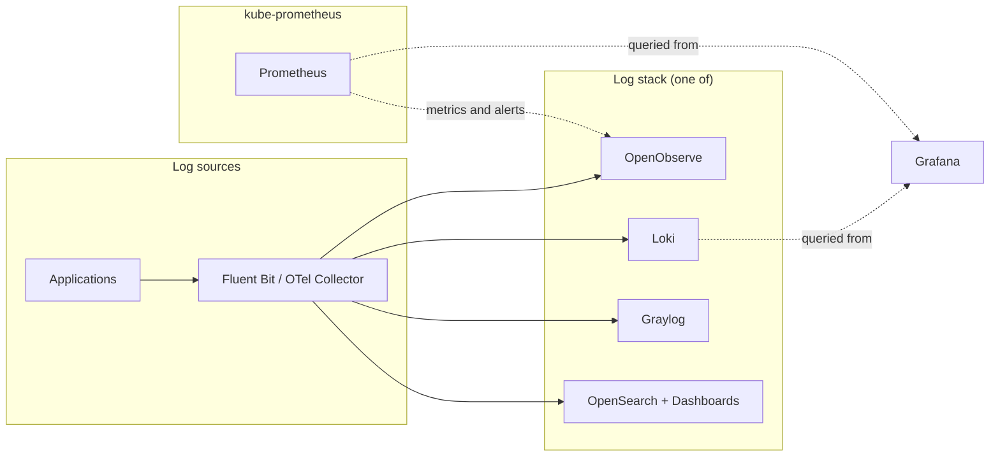

# Monitoring in KubeAid

KubeAid monitoring has two layers:

1. **Metrics** - `kube-prometheus` (Prometheus, Alertmanager, Grafana)
2. **Logs** - one of OpenObserve, Loki, Graylog, or OpenSearch + Kibana

Per-stack setup and operations are documented in each application's Helm chart README (linked below).

## Metrics: kube-prometheus

[kube-prometheus](https://github.com/prometheus-operator/kube-prometheus) is the default monitoring stack. It provides:

- **Prometheus** - scrapes metrics from ServiceMonitors, PodMonitors, and exporters across the cluster
- **Alertmanager** - routes metric-based alerts to notification channels
- **Grafana** - dashboards for metrics visualization

Configuration is managed per cluster via Jsonnet (`<cluster-name>-vars.jsonnet`) and built into Kubernetes manifests.
See [Prometheus Configuration](./kubeaid/prometheus-configuration.md) for details.


```mermaid
flowchart LR
    subgraph Cluster["Kubernetes Cluster"]
        Apps["Apps and System Components"]
        Exporters["Prometheus Exporters / ServiceMonitors"]
    end

    subgraph Metrics["kube-prometheus"]
        Prom["Prometheus"]
        AM["Alertmanager"]
        Graf["Grafana"]
    end

    Apps --> Exporters
    Exporters --> Prom
    Prom --> AM
    Prom --> Graf
```

## Log monitoring

Log monitoring runs alongside `kube-prometheus`. Each option handles log ingestion, search, and log-based alerting on
its own - none of them replace Prometheus for metrics.

| Option | Scope | Log collection | Prometheus integration | Application docs |
| ------ | ----- | -------------- | ---------------------- | ---------------- |
| OpenObserve | Logs, metrics, and alerts | OpenTelemetry (`OTLP`) | Pulls metrics and alerts from Prometheus; alerts on logs | [openobserve](../argocd-helm-charts/openobserve/README.md) |
| Loki | Logs only | Fluent Bit, OpenTelemetry Collector, Grafana Alloy, Promtail | Queried from the same Grafana as Prometheus; optional ServiceMonitor | [loki-stack](../argocd-helm-charts/loki-stack/README.md) |
| Graylog | Logs only | Fluent Bit, Fluentd, Beats, Syslog, GELF, etc. | None (metrics stay in kube-prometheus) | [graylog](../argocd-helm-charts/graylog/README.md) |
| OpenSearch + Kibana | Logs only (ELK-style) | Fluent Bit, Fluentd, OpenTelemetry Collector, etc. | None (metrics stay in kube-prometheus) | [opensearch](../argocd-helm-charts/opensearch/README.md), [opensearch-dashboards](../argocd-helm-charts/opensearch-dashboards/charts/opensearch-dashboards/README.md) |

### OpenObserve

OpenObserve uses the **OpenTelemetry** standard for ingestion. It can ingest logs via OpenTelemetry Collector, pull
metrics and alerts from Prometheus, and provide log-based search and alerting.

- [OpenObserve Helm chart](../argocd-helm-charts/openobserve/README.md)
- [OpenObserve Collector reference](../argocd-helm-charts/openobserve/charts/openobserve-collector/docs/README.md)

### Loki

Loki indexes labels rather than log content, which keeps it cheap to run, and it is queried with LogQL from the
same Grafana that already serves your Prometheus dashboards. That shared query surface is the main reason to pick
it. Logs are pushed to Loki by Fluent Bit, the OpenTelemetry Collector, Grafana Alloy, or any client that speaks
the Loki push API.

- [Loki Helm chart](../argocd-helm-charts/loki-stack/README.md)

### Graylog

Graylog focuses on **log collection and management**. Logs are shipped using agents such as Fluent Bit or other
supported inputs. Graylog does not integrate with Prometheus for metrics or alerting.

- [Graylog Helm chart](../argocd-helm-charts/graylog/README.md)

### OpenSearch and Kibana

OpenSearch with Kibana (or OpenSearch Dashboards) is an alternative to Graylog: centralized log storage, search, and
visualization without a Graylog management layer. KubeAid includes Helm charts for OpenSearch and OpenSearch
Dashboards; Kibana itself is not packaged.

- [OpenSearch Helm chart](../argocd-helm-charts/opensearch/README.md)
- [OpenSearch Dashboards Helm chart](../argocd-helm-charts/opensearch-dashboards/charts/opensearch-dashboards/README.md)


```mermaid
flowchart LR
    subgraph Sources["Log sources"]
        Apps["Applications"]
        Collectors["Fluent Bit / OTel Collector"]
    end

    subgraph Logs["Log stack (one of)"]
        OO["OpenObserve"]
        LK["Loki"]
        GL["Graylog"]
        OSD["OpenSearch + Dashboards"]
    end

    subgraph Metrics["kube-prometheus"]
        Prom["Prometheus"]
    end

    Collectors --> OO
    Collectors --> LK
    Collectors --> GL
    Collectors --> OSD
    Apps --> Collectors
    Prom -. metrics and alerts .-> OO
    LK -. queried from .-> Graf["Grafana"]
    Prom -. queried from .-> Graf
```

## Alerting strategy

- **Metric alerts** - Prometheus rules evaluated by Prometheus, routed by Alertmanager
- **Log alerts** - evaluated by the log stack (OpenObserve, Loki, Graylog, or OpenSearch)

Metrics tell you that something is unhealthy; logs help explain why.

## Additional monitoring capabilities

### Orphan PVC detection

<!-- markdownlint-disable MD013 -->
The `orphan-pvc` kube-prometheus mixin (in `build/kube-prometheus/mixins/orphan-pvc/`) fires the
`KubeDetectOrphanPvc` alert when one or more PersistentVolumeClaims are `Bound` but not mounted by
any running Pod for over 1 hour. This helps catch orphaned volumes consuming storage unnecessarily.
<!-- markdownlint-enable MD013 -->

Enable it in your cluster's Jsonnet vars:

```jsonnet
addMixins: {
  'orphan-pvc': true,
},
```

### ZFS snapshot replication alerts

<!-- markdownlint-disable MD013 -->
The `prometheus-linuxaid` chart includes alerts for ZFS snapshot replication health on bare-metal
nodes:
<!-- markdownlint-enable MD013 -->

| Alert | Fires When |
| ----- | ---------- |
| `monitor::system::zfs::snapshot_missing_on_replica` | A snapshot exists on the source but is missing on the replica |
| `monitor::system::zfs::replica_snapshot_stale` | The newest replicated snapshot for a dataset is older than 2 hours |

Both alerts fire at `critical` severity after 30 minutes.

### Backup exporter

<!-- markdownlint-disable MD013 -->
The backup exporter in the [`kubeaid-agent`](../argocd-helm-charts/kubeaid-agent/) chart monitors Velero
and PostgreSQL backup health via dedicated Prometheus metrics and alerts. See the
[Backup Exporter guide](./guides/backup-exporter.md) for details.
<!-- markdownlint-enable MD013 -->

### Security scan alert duration

The `SecurityScanFailing` alert duration was changed from 1 hour to **24 hours** (commit `6e29177d2`)
to reduce noise from transient scan failures. Adjust in your values if you need a different threshold.

## Further reading

- [Prometheus Configuration](./kubeaid/prometheus-configuration.md) - kube-prometheus setup and Jsonnet build,
  including namespace scrape scope and pod autoscaling with custom metrics
- [Backup Exporter](./guides/backup-exporter.md) - Velero and PostgreSQL backup monitoring
